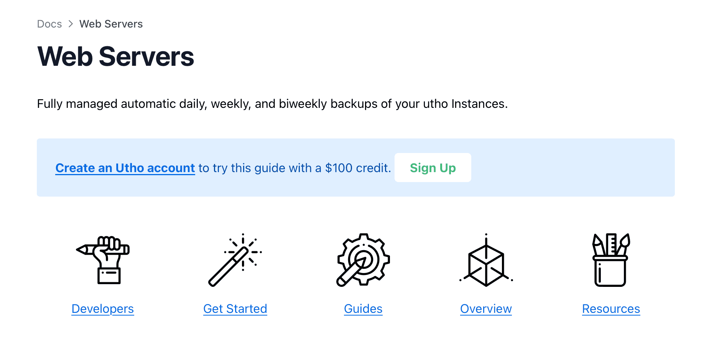
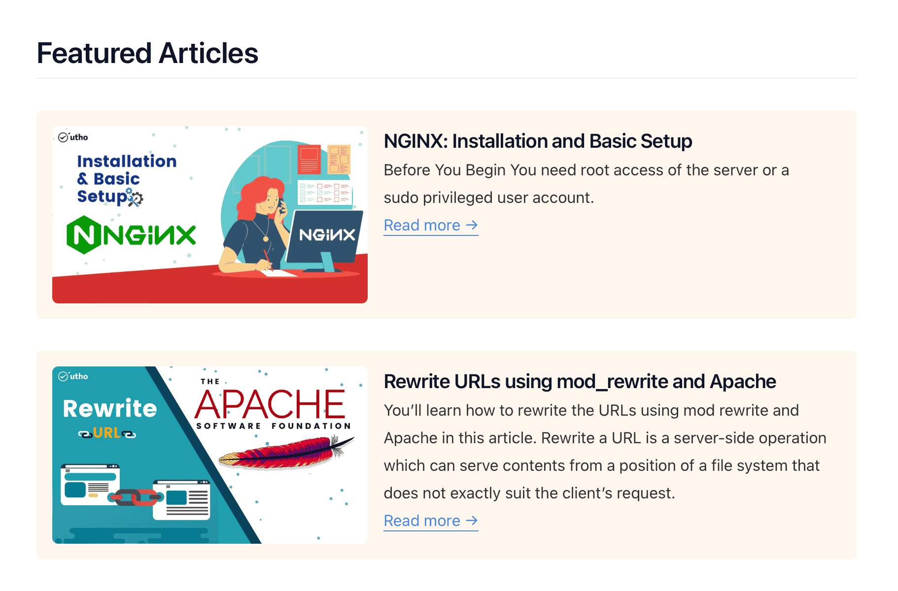
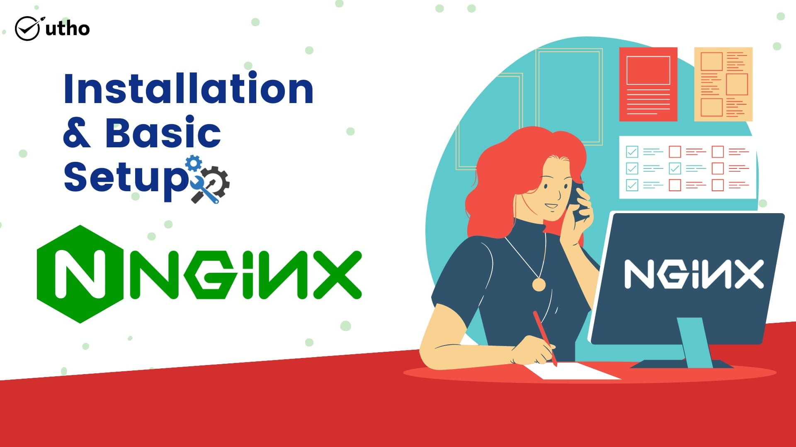
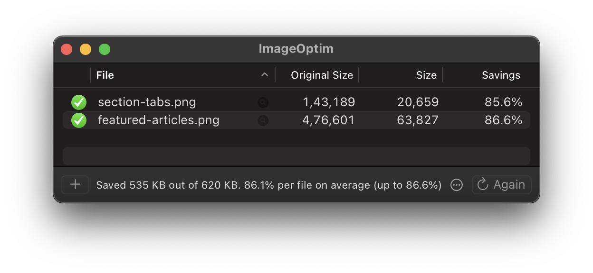

# utho Docs
[🧑🏻‍💻Website 🔗](https://utho.com/docs/)

## Local Development

Pre-requisites: [Hugo](https://gohugo.io/getting-started/installing/), [Go](https://golang.org/doc/install) and [Git](https://git-scm.com)

```shell
# Start server for development
hugo mod tidy
hugo server --logLevel debug --disableFastRender -p 1313

# Start server for production
hugo mod tidy
hugo server -p 1313
```

## Site Config

•  `config > _default > hugo.yaml` for development settings
•  `config > production > hugo.yaml` for production settings
Google analytics, disqus etc. go into production, do not have them in _default.
Refer to official [Hugo docs](https://gohugo.io/documentation/) for better undertanding.

Any theme specific settings can be found here: [Hextra Docs](https://imfing.github.io/hextra/docs/)
(Not all settings are implemented and hence should be checked locally for function. Example: gisqus has been ommited and instead diqus has been implemented )

### Required settings for theme functions to work.
```yaml
module:
  imports:
  - path: hextra

markup:
  goldmark:
    renderer:
      unsafe: true
  highlight:
    noClasses: false
```

*Theme supports built-in inline shortcodes*
<pre>
params:
  enableInlineShortcodes: true
</pre>
*Reference: https://imfing.github.io/hextra/docs/guide/shortcodes/*

### Search 
Full-text search powered by [FlexSearch](https://github.com/nextapps-de/flexsearch) is enabled by default. To customize the search index, set the `params.search.flexsearch.index` parameter in the config file:

```yaml
params:
  # Search
  search:
    enable: true
    type: flexsearch

    flexsearch:
      # index page by: content | summary | heading | title
      index: content
```
-   `content`  - full content of the page (default)
-   `summary`  - summary of the page, see  [Hugo Content Summaries](https://gohugo.io/content-management/summaries/)  for more details
-   `heading`  - level 1 and level 2 headings
-   `title`  - only include the page title

To customize the search tokenize, set the  `params.search.flexsearch.tokenize`parameter in the config file:

hugo.yaml

```yaml
params:
    # ...
    flexsearch:
      # full | forward | reverse | strict 
      tokenize: forward
```

Options for  [`flexsearch.tokenize`](https://github.com/nextapps-de/flexsearch/#tokenizer-prefix-search):

-   `strict`  - index whole words
-   `forward`  - incrementally index words in forward direction
-   `reverse`  - incrementally index words in both directions
-   `full`  - index every possible combination

To exclude a page from the search index, set the `excludeSearch: true` in the front matter of the page:

```yaml
---
title: Configuration
excludeSearch: true
---
```

### Google Analytics

To enable  [Google Analytics](https://marketingplatform.google.com/about/analytics/), set  `services.googleAnalytics.ID`  flag in  `hugo.yaml`:

```yaml
services:
  googleAnalytics:
    ID: G-MEASUREMENT_ID
```

## Custom Theme Features

### Section Tabs:
These are sub-folders with there own **_index.md** and `tab: true` in the front-matter.



- Link to **Section Tabs** automatically appear on Parent Section. There can be as many section tabs as needed.
- **icon** is required for page layout and recommended. icon should be mentioned with filename `icon: icon-name` in the front-matter.
- **icon size** should be standard **128 x 128, 256 x 256 or 512 x 512**
- **icon filename** should be alphabets/numbers or hyphens only, no spaces, no special symbols.
- **Section tab articles** should be created inside respective section tab folder to appear categorically.

### Featured Articles
Files with `featured: true` in the front matter appear categorically and exclusively under sections/sub-sections.



### Images and Thumbnails
Article list thumbnails are automatically created from the first image of the article A standard aspect ratio of 720p, 1080p should be good enough for almost all display sizes.

Thumbnail specific images should always be in proper aspect ratio to maintain documentation standards and uniform layout.

Example image that also shows up as thumbnail:



It is highly recommended to optimise all images for faster build and smaller payload, use tools like [imageoptim](https://imageoptim.com/mac), [Pinga](https://css-ig.net/pinga), [Trimage](https://trimage.org) or any cli based utility  before uploading.
Standard settings could be `JPEG 80%, PNG 40%, SVG 40%` or as per your organisation standards.



### Custom Template Layouts

Page layouts can be overridden by placing a custom front-matter `layout: some-layout-name` at `_index.md` of list type page or at `index.md` of single pages. 

The layout template goes into respective folder with filename exactly same as above so it will be `some-layout-name.html`

**For Example:** 
- Category "Web-servers" uses `/layouts/docs/list.html`. 
- Copy `list.html` to  `/layouts/docs/some-customlayout.html`  
- Add filename to the front-matter `/content/Web-Servers/_index.md` as below:

```yaml
---
weight: 20
title: "Web-Servers Page"
layout: some-customlayout
---
```
 Now the `some-customlayout.html` is used exclusively on pages where `layout: some-customlayout` is set.

Related Hugo Docs: 
[# Template lookup order](https://gohugo.io/templates/lookup-order/) • 
[# Layout](https://gohugo.io/methods/page/layout/) • 
[# Type](https://gohugo.io/methods/page/type/)

### Things to keep in mind:
Hugo has insane/quirky caching for HTML outputs while building, 
- Refresh browser page manually or navigate away and come back.
- Make sure Hugo has finished working in the terminal or deployed completely.
- Try with restarting Hugo server when things are done correct but don't seem to be working, you would be surprised. 😉
