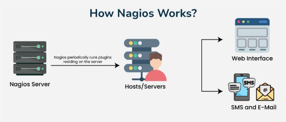
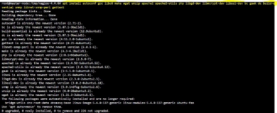
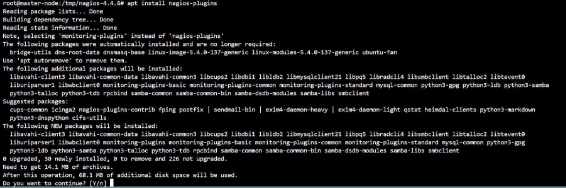
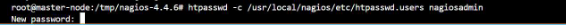
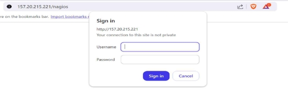
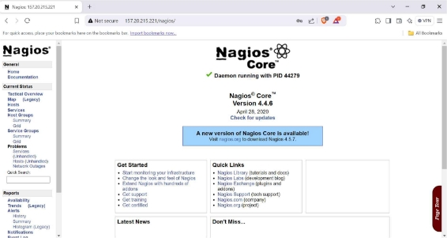
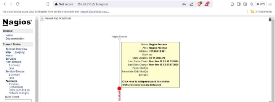

4   Satyajit Barik 

` `How to install Nagios on Ubuntu 22.04

An open-source program for monitoring IT systems, Nagios assists businesses in loca  ng and fixing issues with their IT infrastructure. 

What it does  

Linux, Windows, and Unix-powered devices are monitored by Nagios. It rou  nely examines crucial server, network, and applica  on parameters like:  

- Memory use  
- Disk use  
- Microprocessor load  
- Number of currently running processes  
- Log files  
- Services such as Simple Mail Transfer Protocol (SMTP), Post Office Protocol 3, and Hypertext Transfer Protocol (HTTP) 

What's available 

Nagios Enterprises offers mul  ple products, including:  

- Nagios XI: Monitors your en  re IT infrastructure  
- Nagios Log Server: Views, analyzes, and archives logs from any source in one central loca  on 

Step-1 

Update and Upgrade 

Making sure your system is up to date is the first step. Launch the following commands on a terminal: 

apt update && apt upgrade -y 

Step-2 

Install Prerequisites 

Ubuntu 22.04 server has to have certain applica  ons installed in order to use Nagios 

apt install autoconf gcc libc6 make wget unzip apache2 apache2-u  ls php libgd-dev 

libmcrypt-dev libssl-dev bc gawk dc build-essen  al snmp libnet-snmp-perl ge  ext

Step-4 

Create a Nagios User and Group 

Nagios should run as a separate user and group. Create them with the following commands: 

useradd -m -s /bin/bash nagios groupadd nagcmd 

usermod -a -G nagcmd nagios usermod -a -G nagcmd www-data 

Step-5 

Download and Compile Nagios on Ubuntu 

Download and compile Nagios Core immediately. To save the Nagios source code, we'll make a directory, navigate to it, and proceed to retrieve the source archive. 

cd /tmp wget h  ps://assets.nagios.com/downloads/nagioscore/releases/nagios-4.4.6.tar.gz 

Step-6 

Extract and Compile Nagios Core 

tar -zxvf nagios-4.4.6.tar.gz cd nagios-4.4.6 

Next, configure Nagios on Ubuntu and compile it: 

./configure --with-nagios-group=nagios --with-command-group=nagcmd make all 

Step-7 

Install Nagios on Ubuntu binaries, init script, and web interface files. 

make install 

make install-commandmode 

make install-init 

make install-config 

/usr/bin/install -c -m 644 sample-config/h  pd.conf /etc/apache2/sites-available/nagios.conf 

Step-8 

Install Nagios on Ubuntu Plugins 

apt update 

apt install nagios-plugins 

cp /usr/lib/nagios/plugins/\* /usr/local/nagios/libexec/ 

It’s important to rebuild the Nagios configura  on and restart Nagios a  er installing or upda  ng plugins: - 

/usr/local/nagios/bin/nagios -v /usr/local/nagios/etc/nagios.cfg 

systemctl restart nagios 

systemctl restart apache2 

Step-9 

Configure Apache Web Server 

Create a symbolic link for the Nagios Apache configura  on file and enable the site: 

ln -s /etc/apache2/sites-available/nagios.conf /etc/apache2/sites-enabled/ 

Enable CGI and rewrite modules for Apache: 

a2enmod cgi rewrite 

Step-10 

Set Nagios Admin Password (You can set User name Accordingly, I’m use nagiosadmin) 

|htpasswd -c /usr/local/nagios/etc/htpasswd.users nagiosadmin||
| - | :- |
|
Step-11 

Start Nagios and Apache Services 
||

systemctl enable nagios systemctl enable apache2 systemctl restart nagios systemctl restart apache2 

Access Nagios Web Interface 

Open your web browser and navigate to h  p://your\_server\_ip/nagios 

Fill Username and password: - 

Here your Home Page: - 

Click on MAP to see Current status 

~Thank You~ 
