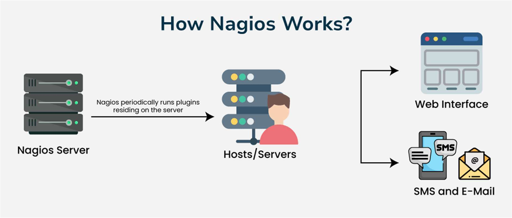
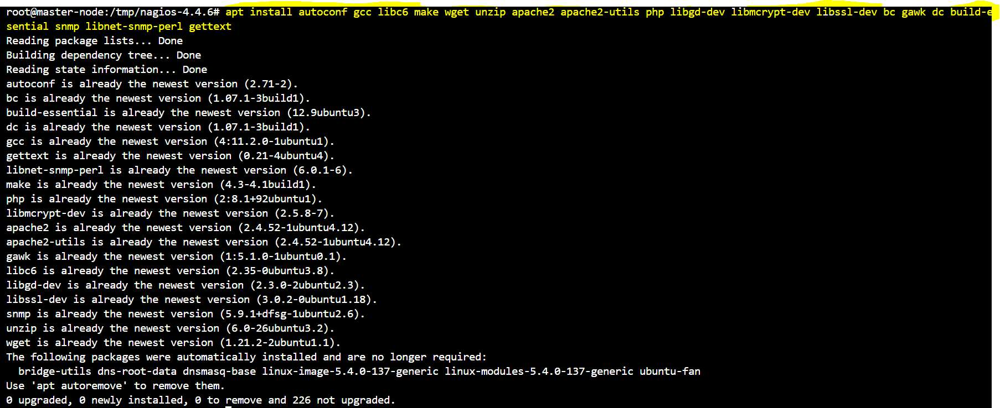
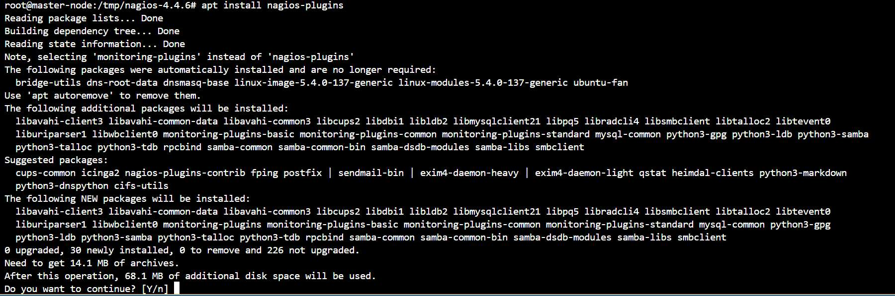
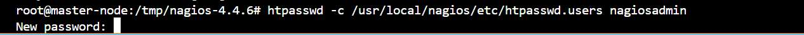
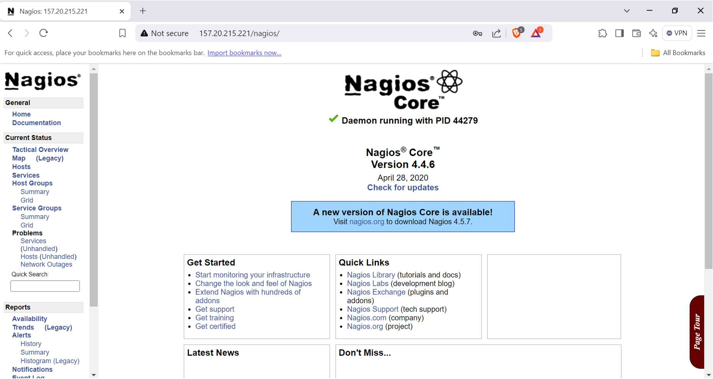
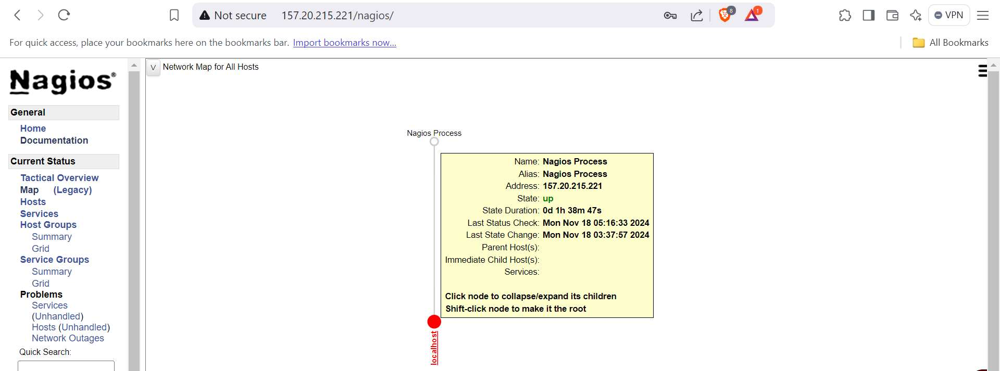
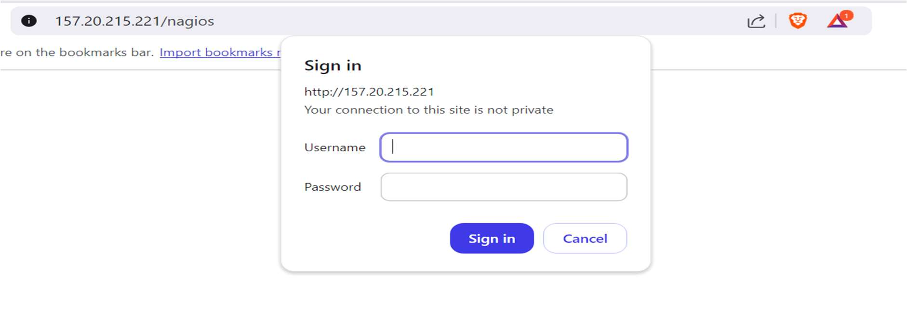

> 1 Satyajit Barik style="width:5.89667in;height:2.515in" />
>
> <u>How to install Nagios on Ubuntu 22.04</u>
>
> An open-source program for monitoring IT systems, Nagios assists
> businesses in loca ng and fixing issues with their IT infrastructure.
>
> <u>What it does</u>
>
> Linux, Windows, and Unix-powered devices are monitored by Nagios. It
> rou nely examines crucial server, network, and applica on parameters
> like:
>
>  Memory use  Disk use
>
>  Microprocessor load
>
>  Number of currently running processes  Log files
>
>  Services such as Simple Mail Transfer Protocol (SMTP), Post Office
> Protocol 3, and Hypertext Transfer Protocol (HTTP)
>
> <u>What's available</u>
>
> Nagios Enterprises offers mul ple products, including:  Nagios XI:
> Monitors your en re IT infrastructure
>
>  Nagios Log Server: Views, analyzes, and archives logs from any
> source in one central loca on
>
> <u>Step-1</u>
>
> Update and Upgrade
>
> Making sure your system is up to date is the first step. Launch the
> following commands on a terminal:
>
> apt update && apt upgrade -y
>
> <u>Step-2</u>
>
> Install Prerequisites
>
> Ubuntu 22.04 server has to have certain applica ons installed in order
> to use Nagios
>
> apt install autoconf gcc libc6 make wget unzip apache2 apache2-u ls
> php libgd-dev libmcrypt-dev libssl-dev bc gawk dc build-essen al snmp
> libnet-snmp-perl ge ext
>
> 2 Satyajit Barik style="width:5.89167in;height:2.40667in" />
>
> <u>Step-4</u>
>
> Create a Nagios User and Group
>
> Nagios should run as a separate user and group. Create them with the
> following commands:
>
> useradd -m -s /bin/bash nagios groupadd nagcmd
>
> usermod -a -G nagcmd nagios usermod -a -G nagcmd www-data
>
> <u>Step-5</u>
>
> Download and Compile Nagios on Ubuntu
>
> Download and compile Nagios Core immediately. To save the Nagios
> source code, we'll make a directory, navigate to it, and proceed to
> retrieve the source archive.
>
> cd /tmp wget h
> ps://assets.nagios.com/downloads/nagioscore/releases/nagios-4.4.6.tar.gz
>
> <u>Step-6</u>
>
> Extract and Compile Nagios Core
>
> tar -zxvf nagios-4.4.6.tar.gz cd nagios-4.4.6
>
> Next, configure Nagios on Ubuntu and compile it:
>
> ./configure --with-nagios-group=nagios --with-command-group=nagcmd make
> all
>
> <u>Step-7</u>
>
> Install Nagios on Ubuntu binaries, init script, and web interface
> files.
>
> make install
>
> make install-commandmode make install-init
>
> make install-config
>
> /usr/bin/install -c -m 644 sample-config/h pd.conf
> /etc/apache2/sites-available/nagios.conf
>
> 3 Satyajit Barik style="width:5.89167in;height:1.955in" />
>
> <u>Step-8</u>
>
> Install Nagios on Ubuntu Plugins apt update
>
> apt install nagios-plugins
>
> cp /usr/lib/nagios/plugins/\* /usr/local/nagios/libexec/
>
> It’s important to rebuild the Nagios configura on and restart Nagios a
> er installing or upda ng plugins: -
>
> /usr/local/nagios/bin/nagios -v /usr/local/nagios/etc/nagios.cfg
> systemctl restart nagios
>
> systemctl restart apache2
>
> <u>Step-9</u>
>
> Configure Apache Web Server
>
> Create a symbolic link for the Nagios Apache configura on file and
> enable the site: ln -s /etc/apache2/sites-available/nagios.conf
> /etc/apache2/sites-enabled/
>
> Enable CGI and rewrite modules for Apache: a2enmod cgi rewrite
>
> <u>Step-10</u>
>
> Set
> Nagios Admin Password (You can set User name Accordingly, I’m use
> nagiosadmin) htpasswd -c /usr/local/nagios/etc/htpasswd.users
> nagiosadmin
>
> <u>Step-11</u>
>
> Start Nagios and Apache Services systemctl enable nagios systemctl
> enable apache2 systemctl restart nagios systemctl restart apache2
>
> <u>Access Nagios Web Interface</u>
>
> Open your web browser and navigate to h p://your_server_ip/nagios
>
> 4 Satyajit Barik style="width:5.89667in;height:3.13667in" /> style="width:5.89167in;height:2.18833in" /> style="width:5.89667in;height:2.16667in" />
>
> Fill Username and password: -
>
> Here your Home Page: -
>
> Click on MAP to see Current status
>
> ~Thank You~
