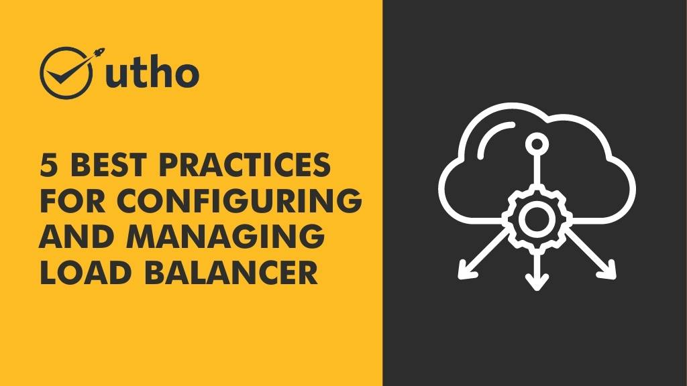

A **load balancer** is an essential tool in any business’s IT infrastructure. It ensures that traffic is distributed evenly across servers, helping to prevent performance bottlenecks that can lead to outages. As such, it’s important to configure and manage your load balancer correctly. Here are five tips for doing just that. 

Must Read : [6 Benefits of Deploying a Load Balancer on your server.](https://utho.com/docs/tutorial/6-benefits-of-deploying-a-load-balancer-on-your-server/)

## 1\. Monitor Your Servers Closely

To ensure peak performance from your load balancer, you need to monitor the servers it's connected to. This means monitoring all of the server's resources ([CPU usage](https://www.techopedia.com/definition/28291/cpu-utilization), memory utilization, etc.) on a regular basis so that you can quickly identify any potential issues and address them before they cause major problems. 

## 2\. Know Your Traffic Patterns

Load balancers are most effective when they're configured according to specific traffic patterns. So, take some time to study the traffic coming into your website or application and adjust your configuration accordingly. Doing so will allow you to optimize your setup for maximum efficiency and minimize potential outages due to unexpected spikes in traffic or other irregularities. 

## 3\. Use Autoscaling When Possible

Autoscaling is a great way to ensure that your load balancer always has enough capacity to handle incoming traffic without bogging down the system or causing outages due to overloading resources. Not only does it help save on costs by allowing you scale up or down as needed, but it also makes sure that users always have access to the services they need when they need them most. 

## 4\. Utilize Automated Monitoring Tools

Automated monitoring tools can be used in conjunction with your load balancer configuration in order to detect any issues before they become serious problems and make sure everything is running smoothly at all times. The more data you collect from these tools, the better informed decisions you'll be able make when it comes time for maintenance or upgrades down the line. 

## 5\. Keep Backup Systems In Place

Nothing lasts forever, including your load balancer configuration and hardware setup – which is why having backup systems in place is so important! This could mean anything from having multiple failover systems ready in case of an emergency or simply keeping redundant copies of all configurations and settings so that you can quickly restore service should something go wrong with the primary setup. 

A **load balancer** can be a powerful tool for **managing traffic on your website or application**. By following these best practices, you can ensure that your load balancer is properly configured and able to handle the traffic demands of your users. If you do not have a load balancer in place, we recommend considering one as part of your infrastructure.
