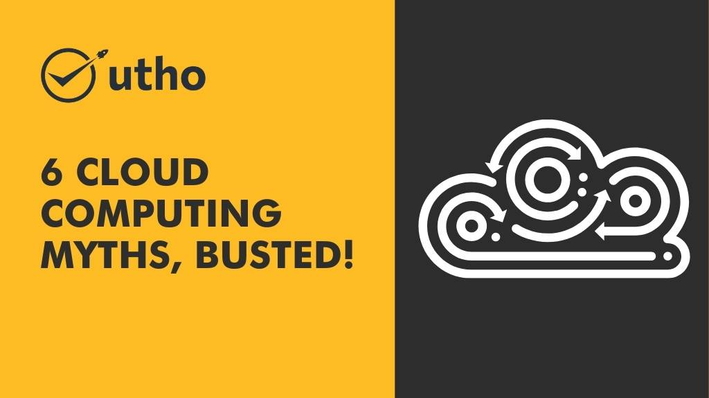

There's a lot of misinformation out there about cloud computing. We're here to set the record straight and bust some of the most common cloud computing myths!

## **What is cloud computing?** 

Before busting the myths, let’s understand what cloud computing is! Cloud computing delivers servers, storage, [databases](https://en.wikipedia.org/wiki/Database), networking, software, analytics, and intelligence services over the Internet (“the cloud”) to offer faster innovation, flexible resources, and economies of scale. 

With cloud computing, businesses can avoid the upfront investment in hardware and software infrastructure and instead pay for only the resources they use on a pay-as-you-go basis. This flexibility enables organizations to respond quickly to changing business needs while controlling IT costs. In addition, cloud services can be scaled up or down as needed without extensive planning or reengineering. 

## **The myths of cloud computing.**

<figure>

<figcaption>

most common cloud computing myths

</figcaption>

</figure>

## **1\. Myth: The cloud is expensive.**

Busted! Moving to the cloud can save your business money in the long run. With on-premise infrastructure, you must pay for power, cooling, and physical space to house your servers. With the cloud, you only pay for the resources you use. Plus, you don't have to worry about upkeep and maintenance costs.

## **2\. Myth: The cloud is unreliable.**

Busted! Cloud providers invest heavily in ensuring that their data centers are reliable and always available. Clouds are often more reliable than on-premise infrastructure because they have built-in redundancy mechanisms. For example, if one data center goes down, your cloud provider can quickly spin up another to take its place.

## **3\. Myth: The cloud is insecure.** 

Busted! Cloud providers go to great lengths to secure their data centers and keep customer data safe. They have teams of security experts who constantly monitor for threats and implement new security measures as needed. Plus, the data stored in the cloud is typically encrypted, making it even more difficult for hackers to access.

## **4\. Myth: The cloud is complicated.** 

Busted! Cloud providers offer a variety of tools and resources to help customers get started with the cloud and make the most of its features. Plus, many [providers](http://microhost.com) offer 24/7 support if you encounter any technical issues. 

## **5\. Myth: The cloud is only for big businesses.** 

Busted! While enterprises are certainly embracing the cloud, it's also being used by small businesses and individuals who need a simple, cost-effective way to store and share data online. 

## **6\. Myth: The cloud is only for storage.** 

Busted! While storage is one of the most popular uses for the cloud, it's far from the only use case. Many businesses rely on the cloud for computing resources, application hosting, data analysis, etc. 

**Conclusion:**  Moving to the cloud can be beneficial for your business in terms of costs, reliability, performance, scalability, and security. Don't let myths about the cloud stop you from exploring what it can do for your organization. [Microhost](https://utho.com/) provides top-notch cloud computing services. The best part is that you can try it out for seven days without risk.
