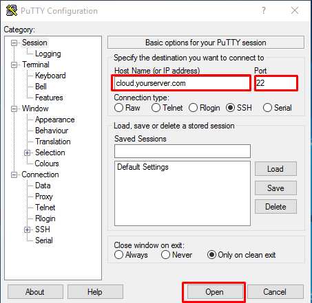

CWP is an free and paid license based hosting panel for managing website database,emails,file,etc using a single Panel. In this article we will discuss how to install CWP in Centos 7


## Software Requirements

You must have a clean/fresh installation of supported operating systems:  
CentOS 6, RedHat 6 or CloudLinux 6, MINIMAL installation and English version only!  
CentOS 7 is also supported, we recommend minimal version.  
CentOS 8 is **NOT** supported yet.

## Hardware Requirements

32 bit operating systems require a minimum of 512 MB RAM  
64 bit operating systems require a minimum of 1024 MB RAM (recommended)  
Recommended System: 4 GB+ RAM so you would have the full functionality such as Anti-virus scan of emails.

## CWP-Installation:-

Step:-1. Access your server using putty or terminal with ssh by ssh command.



Step:- 2. After access server run the below command for download and install CWP script.


**For** **CentOS 6: New Installer with MARIA-DB 10-latest**

```
 [root@CWP ~]# cd /usr/local/src 
```

```
 [root@CWP ~]# wget http://centos-webpanel.com/cwp-latest 
```

```
 [root@CWP ~]# sh cwp-latest 
```

**For** **CentOS 7: Installer for CentOS 7**

```
 [root@CWP ~]# cd /usr/local/src 
```

```
 [root@CWP ~]# wget http://centos-webpanel.com/cwp-el7-latest 
```

```
 [root@CWP ~]# sh cwp-el7-latest 
```

Step:- 3. After run the installer script wait for 30-40 minutes for completed CWP installation .

Step:- 4. As CWP installation will complete. You need to reboot the server.

```
 [root@CWP ~]# reboot 
```

## CWP-Configuration:-

You can Login into CWP admin Panel using url http://server-ip:2030/ or http://hostname:2030


– Setup nameservers  
– Setup shared ip (must be your public IP address)  
– Setup at least one hosting package (or edit default package)  
– Setup root email

Now CWP installation and Configuration is completed and CWP Panel is ready to use.

Thankyou..
