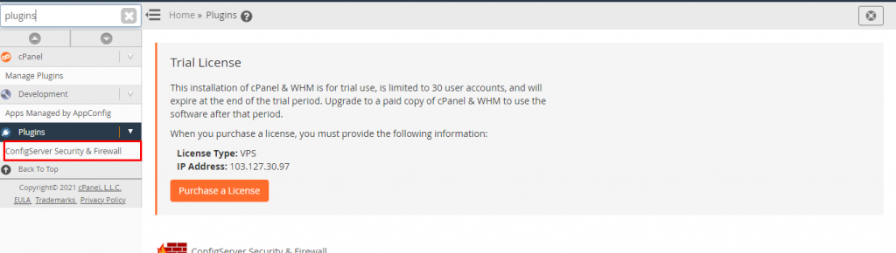

ConfigServe Firewall (CSF) is a firewall configuration tool that was created to enhance server security by providing a simple yet powerful interface for configuring firewall settings on cPanel servers.

This programme is freely downloadable as a WHM plugin. To perform a simple CSF installation, follow these steps.

**Install CSF:** Log into your server as root, using SSH.  
Follow below given command

```
# cd /usr/local/src/ 
```

You will obtain the following image after running this command:


After changing the directory, use the following command to start the download:

```
# wget https://download.configserver.com/csf.tgz 
```


After you've finished downloading, run the command listed below.

```
# tar -xzf csf.tgz 
```

```
# cd csf 
```

```
# sh install.sh 
```

```
# systemctl status csf.service 
```


Configure CSF: By logging into WHM as root and going to the bottom left menu. Go to ConfigServer Security Firewall in the Plugins area.



Thank you!!
