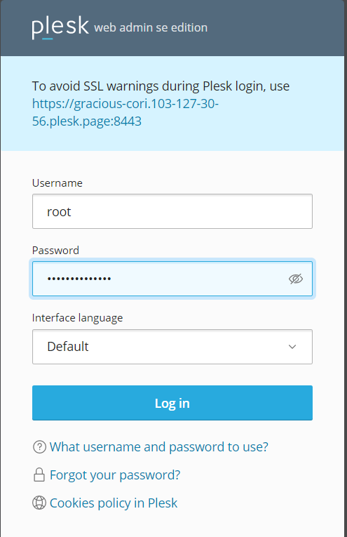
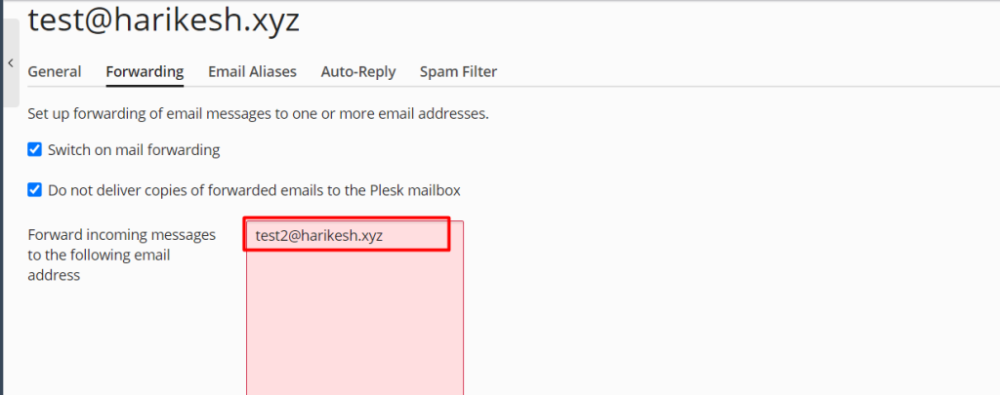

##### Description

In this article you will know How to create an email account in Plesk And set email forwarding, Plesk is a web hosting platform that comes with a control panel that enables the administrator to set up websites, reseller accounts, e-mail accounts, [DNS](https://utho.com/docs/tutorial/category/dns-tutorial/), and databases using a web browser. Integration of support for content management systems (CMS) is included in [Plesk](https://en.wikipedia.org/wiki/Plesk). These content management systems include WordPress, Joomla, and Drupal, among others.

**1.login to Plesk**

2.Go to **Domains** > **example.com** > Click Email Addresses and Create Email.

**3\. Complete the relevant fields, and then select "ok" to continue.**

**4.Go to Mail > your email address > the Forwarding tab.**

**5.To activate mail forwarding, choose the corresponding checkbox.**

**6.Also, under this box, type the name of the email address to which you would like to forward messages.**

**Take each step in the order they're shown above to guide**

## 1.**login to Plesk**

## 2.Go to **Domains** > **example.com** > Click Email Addresses and Create Email.

## **3\. Complete the relevant fields, and then select "ok" to continue.**

You can now view the email address that you generated.

**Note**: that the Email Addresses and Email Settings will be concealed within the Domain Dashboard if the Mail Management is turned off for the entire server.

**Now we are going to forward the emails from test1 email to test 2 email**

## **4.Go to Mail > your email address > the Forwarding tab.**

Click on any of the available emails, such as test@harikesh.xyz.

## **5.To activate mail forwarding, choose the corresponding checkbox.**

## **6.Also, under this box, type the name of the email address to which you would like to forward messages.**

And the click ok

## **You can verify that you have successfully set up email forwarding at this point**.

Hopefully now you can create an email account in Plesk And set email forwarding.

##### **Thank You**
