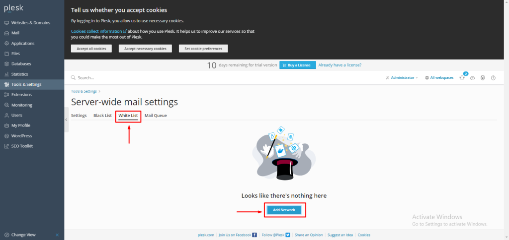

## Introduction

In this article, you will learn how to do Server-wide whitelist in Plesk.

Step 1. Log into your Plesk with your server password by searching server\_ip:8880 in your browser.

Step 2. Go to tools and settings on the left side of the screen, then select [mail server settings](https://utho.com/docs/tutorial/how-to-blacklist-a-domain-in-plesk/) from the mail menu. 

Step 3. Click on the White list. Then click on "add network."

Step 4. Specify an IP address or range of IP addresses from which mail must always be accepted, and then press ok.

## Conclusion

Hopefully, now you have learned how to do Server-wide whitelist in [Plesk](https://en.wikipedia.org/wiki/Plesk).

Thank You 🙂
