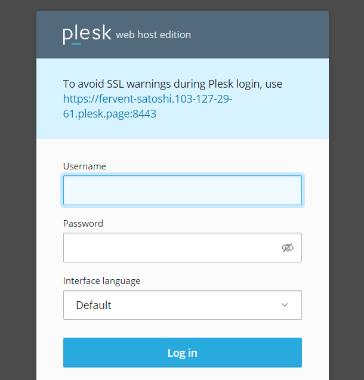
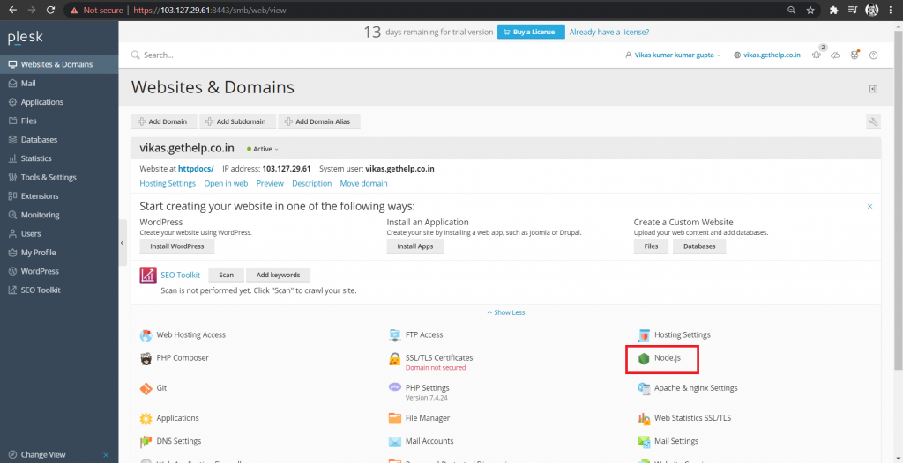
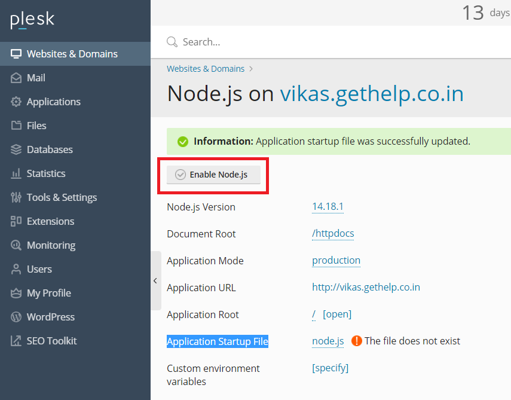

Node.js is an open source server environment. Node.js allows you to run JavaScript on the server. 

**Step 1. Firstly, download the node.js installer for your platform.  
**You can use the link below to download node.js.  
LINK:   [https://nodejs.org/en/download/](https://nodejs.org/en/download/)

**Step 2.  login to Plesk**

**Step 3.  Upload the node.js (that you downloaded) in file manager (in Home Directory > httpdocs)**

Then extract it in the same folder.

  

**Step 4. Go back to "Websites and Domains" and click on the node.js**

If you don't find node.js under your domain, then you have to add it manually. Under Plesk panel, go to Tools and Settings > updates > Add/Remove Components > click to install node.js

**Step 5. Now you can see Node.js under "Websites and Domains". Click on it.**

**Step 6.  Set Application Root to Root Directory**

**Step 7.  Step up Application Startup File to "node.js"**

**Step 8.  Click on enable Node.js**

Node.js Enabled.

**Step 9.  Go back to "Websites and Domains"  and click on "Node.js App' to access your Node.js Application.**

Thank you.
