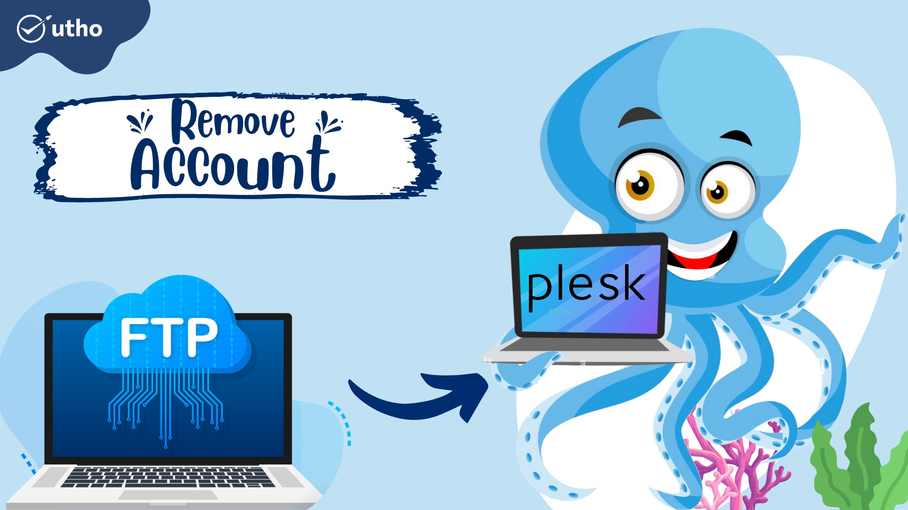
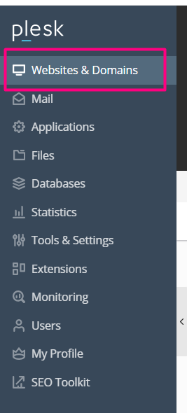
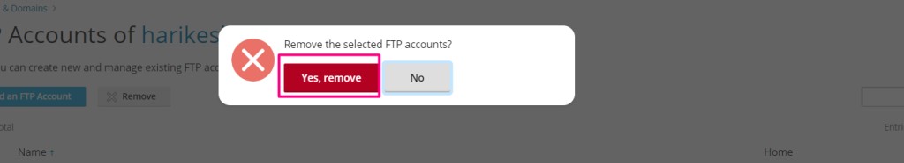

**Introduction**

The abbreviation "[FTP](https://en.wikipedia.org/wiki/File_Transfer_Protocol)" stands for "File Transfer Protocol," which is the name given to a set of guidelines that determine how files are sent between computer systems using the internet. File Transfer Protocol (FTP) is used by businesses to transfer data between computers, and websites utilise FTP to upload and receive files from the servers that host their websites.

1.Go to Websites & Domains And To delete an FTP account for a certain domain, click that domain.

2.click **FTP Access**.

3.Click remove an **FTP account**

4.Select the FTP account you wish to remove by clicking on it

\*Please follow the procedures below to delete your FTP account.

1.Go to Websites & Domains

## \*And To delete an FTP account for a certain domain, click that domain

## 2.click **FTP Access**.

## \*Next, choose the FTP account that you wish to delete by clicking on it, then pressing the button, and finally clicking the "ok" button.

## \* Successfully deleted FTP account

Click to know **[How to add FTP account in plesk](https://utho.com/docs/tutorial/how-to-add-ftp-account-in-plesk/)**

**Thank You**
