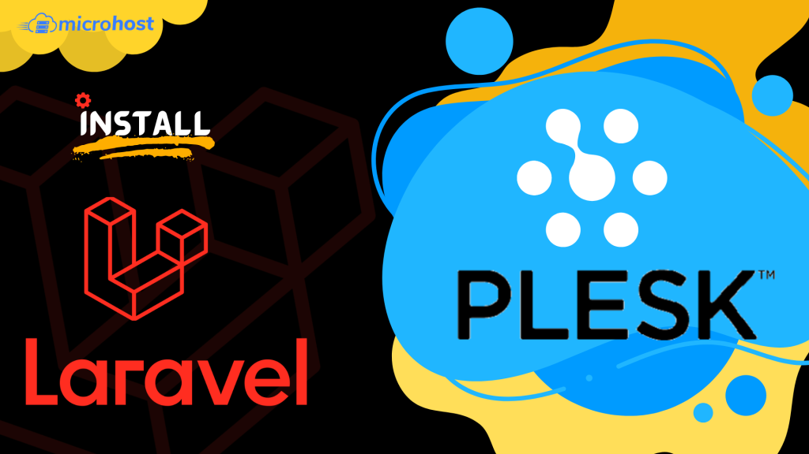
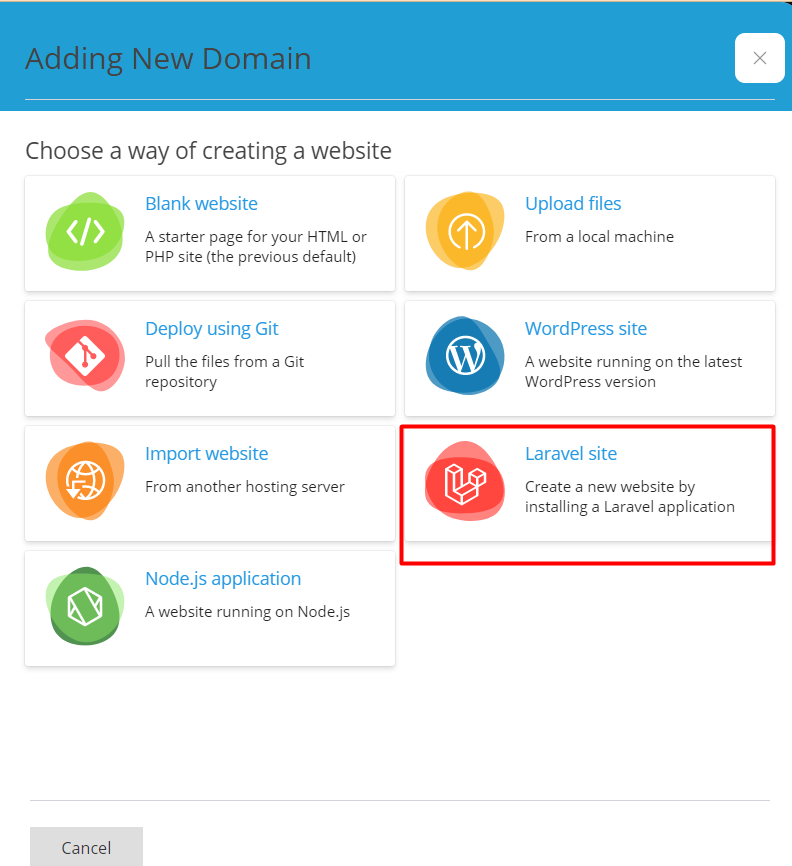
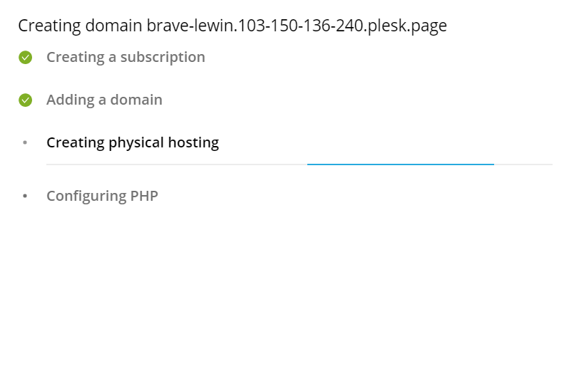
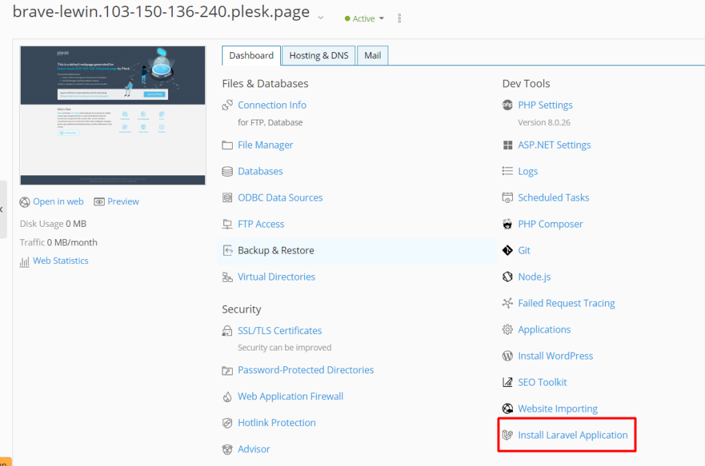
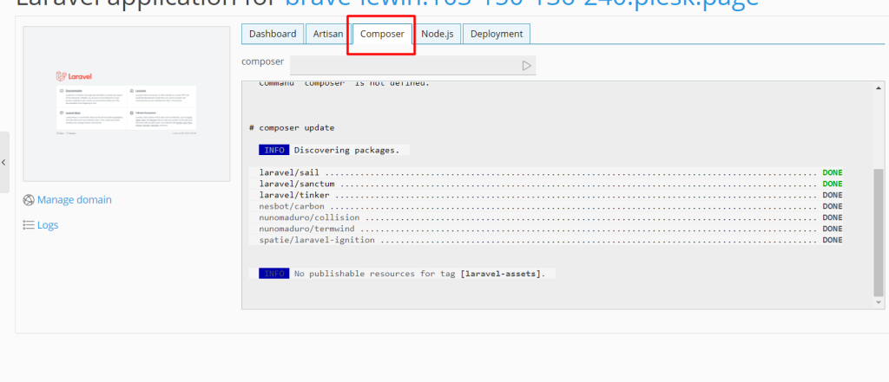

<figure>

<figcaption>

How to install Laravel Application on Plesk serve

</figcaption>

</figure>

**Description**

[Laravel](https://en.wikipedia.org/wiki/Laravel) is an open-source web application framework that simplifies routine tasks that are integral to the majority of web development projects. These tasks include authentication and routing, as well as sessions and caching. It is the goal of Laravel to make the experience of application development more enjoyable for developers without compromising the capabilities of the applications themselves.

Follow the below steps to install Laravel Application on [Plesk server](https://utho.com/docs/tutorial/laravel-application-hosting-in-plesk/).....

## Install Laravel application

open Plesk and navigate to the **'Add Domain'** button. From the drop-down menu that appears, select **'Laravel site'** to begin the process of establishing a new domain.

**Add new domain**

- Don't be concerned if you don't yet have a domain name for your website. For the time being, you can use a temporary domain name.

- Click on temporary domain name and you will get domain name as shown below

- Click add domain and you will see below screenshot

- After the website has been created, Plesk will prompt you to select between installing a default skeleton Laravel application or pulling the application from a remote Git repository. Your selection will be saved automatically. Installing the skeleton is the best way to get acquainted with the Laravel Toolkit's capabilities for the time being.

- Wait for few seconds.

- And it is ready.....

- Your very first Laravel application has been published to the world wide web!

## Laravel Application Configuration

- If you were to hand a mouse a Laravel application, it would probably ask for a database… at least that's what we assume would happen. In any case, let's keep going and submit another application for your consideration.

1.Navigate to the Laravel **dashboard** labelled "Information," then click the "**Manage domain**" button. Following this link will bring you to the "**Hosting**" dashboard.

2.After arriving at that location, select "**Databases**," and then after that, "**Add Database**."

- When you are finished creating the database, you will need to modify the configuration file for the Laravel application so that it contains information about how to connect to the newly created database.

1.Click the button labelled "**Manage Laravel Application**" located on the "**Hosting**" dashboard. Clicking on this link will take you to the Laravel card.

2.After arriving at that location, open the.**env** file and add the database credentials.

- Execute the '**artisan** migrate' command in order to create a database as the final step.  
    And yes, the **'artisan**' utility can be executed directly from within the Plesk user interface. You will need to select the'migrate' command from the list of preloaded commands after you have navigated to the '**Artisan**' tab.

## Manage Laravel Application

- However, there is more to come! In particular, let's take a look at some additional features that, when hosting Laravel applications, save you time.

- It is important to point out that you can rapidly invoke the '**composer**' and '**npm**' commands by simply selecting them from the list of preloaded \* commands, which I discovered to be an indispensable resource:

- If your Laravel application makes use of Laravel Task Scheduling, then in addition to the typical '**artisan schedule:list**' command, you have the ability to quickly review all scheduled jobs by switching to a different tab.

- Laravel is an open-source web application framework that simplifies routine tasks that are common in most web development projects. Authentication and routing, as well as sessions and caching, are examples of these tasks. Laravel's goal is to make application development more enjoyable for developers while not compromising the capabilities of the applications themselves.

Hope you have understood all the things to install Laravel Application on Plesk server..

Must read:- [https://utho.com/docs/tutorial/how-to-check-disk-performance-iops-and-latency-in-linux/](https://utho.com/docs/tutorial/how-to-check-disk-performance-iops-and-latency-in-linux/)

**Thankyou**
