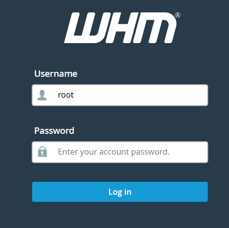
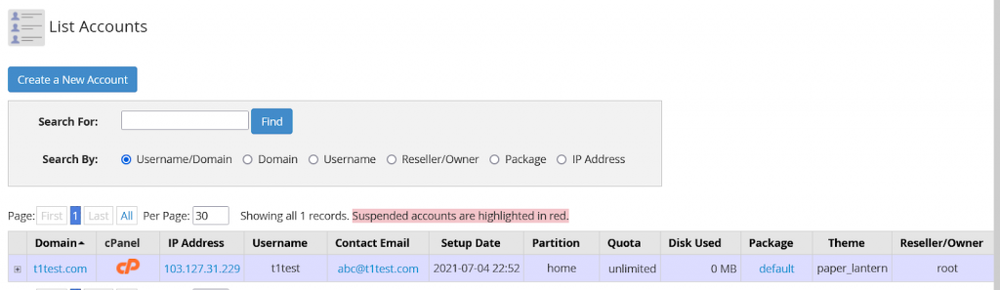
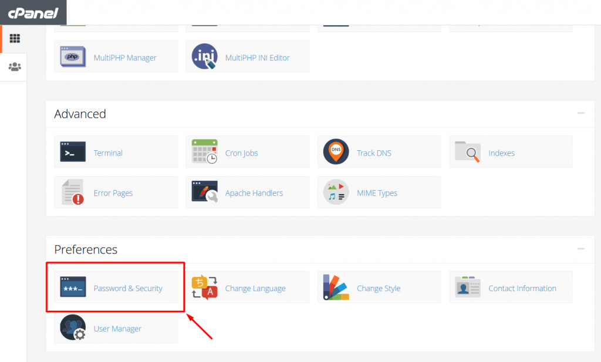
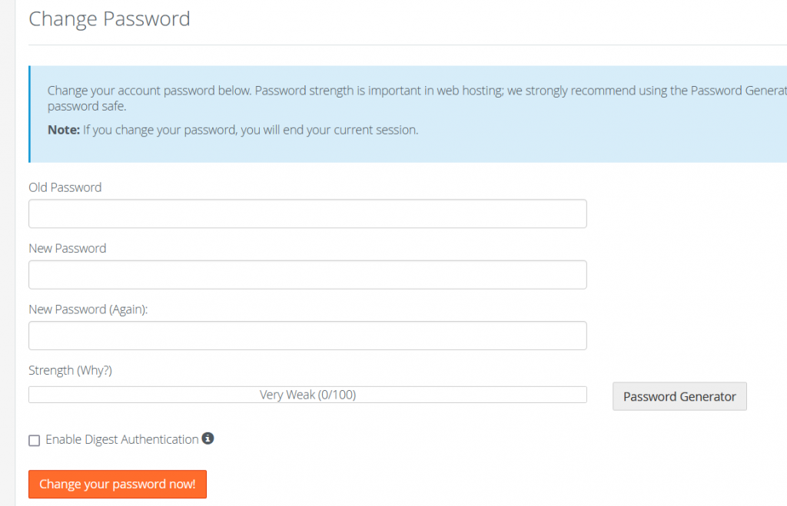

**Step 1:** Login into you Cpanel by opening “ server-ip:2087 ” in the URL of the browser

**Step 2:** login into the WHM using root credentials

**Step 3:** Open List Accounts

**Step 4:** Open the account of cpanel by clicking on the Cpanel Icon

**Step 5:** Open the password and security Option

**Step 6:** Enter old and new password and click on the change your password now

Password has been changed/Updated

Thank you :)
