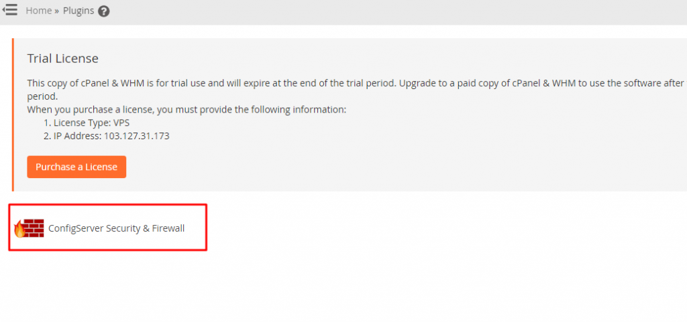
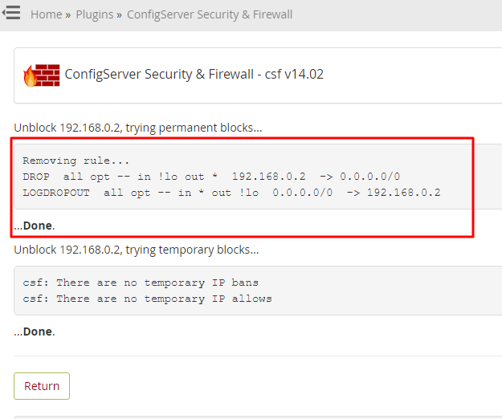

You have sudo or root access to perform this task in WHM/Cpanel

**Step:- 1.** Login to WHM/Cpanel.

**Step:- 2.** Goto plugin or search **plugins** in whm search bar.

**Step:- 3.** Open plugins and goto "**ConfigServer Security Firewall**".

**Step:- 4.** To block ip in CSF enter the ip in section "**Block IP address**"

**Step:- 5.** To Unblock ip in CSF enter the ip in section " **Remove IP address** "

**Step:- 6.** When you will get the below message means ip is unblock from CSF.

Thank you...
