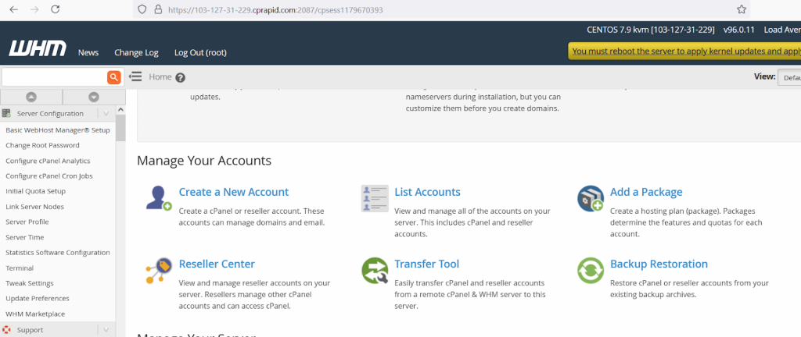
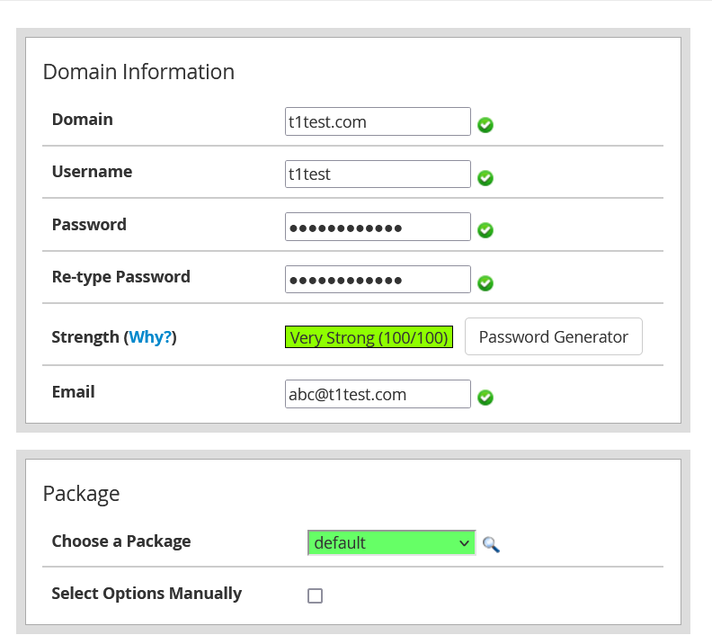

---

**Step 1:** Login into you Cpanel by opening “ server-ip:2087 ” in the URL of the browser

**Step 2:** login into the WHM using root credentials

**Step 3:** Click on the Create a New Account button

**Step 4:** Enter all the mandatory fields and choose a default of customized package if it is present

**Step 5:** After filling all the details , click on the create button to create the account

Thnak you :)
