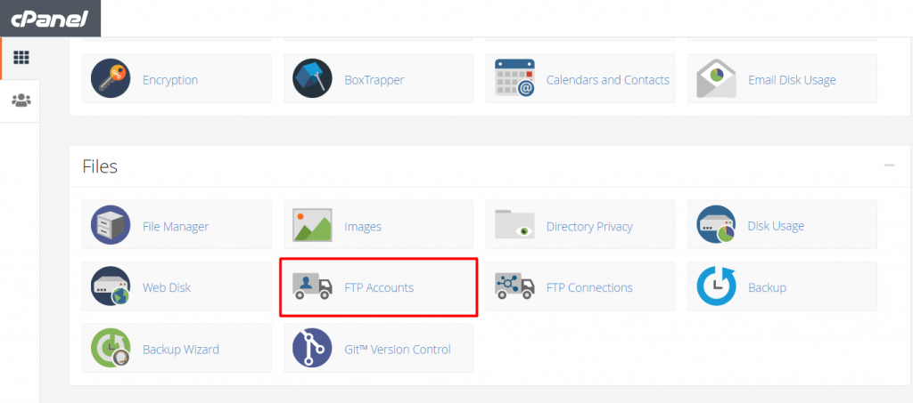
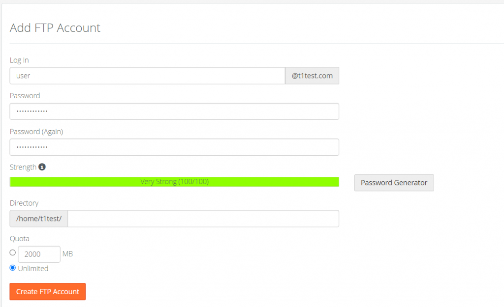
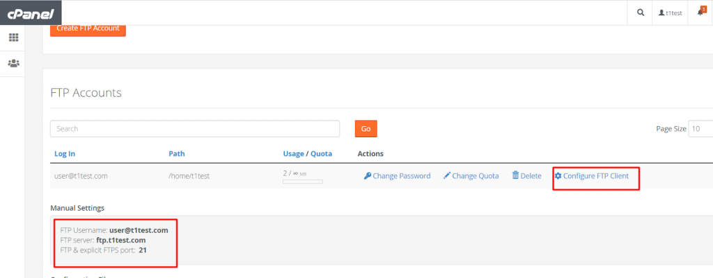
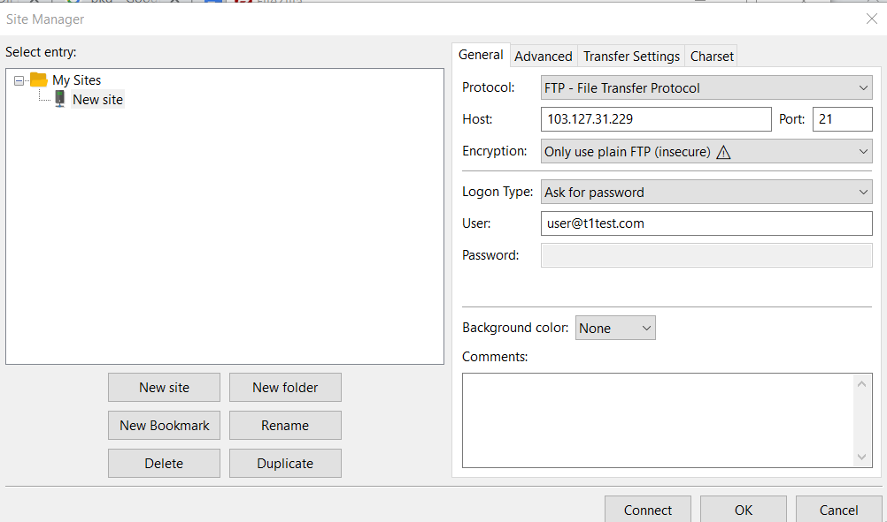
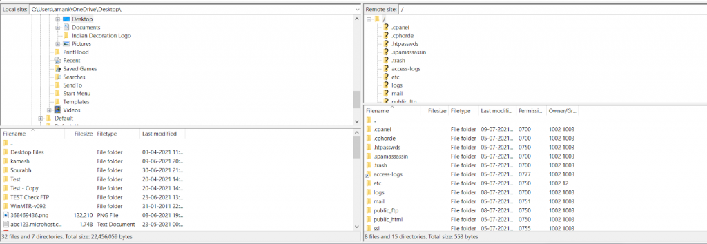

**Step 1:** Login into you Cpanel by opening “ server-ip:2087 ” in the URL of the browser

**Step 2:** login into the WHM using root credentials

**Step 3:** Open List Accounts

**Step 4:** Open the account of cpanel by clicking on the Cpanel Icon

**Step 5:** Open FTP Accounts option

**Step 6:** Enter the required details .

Account has been created

**Step 7:** Click on the configure FTP client for the username , server and port of FTP .

**Step 8:** Open file zilla site manager and add the following protocol , host (IP) , Encryption ,Login type and username password for the connection .

Click on connect

**Step 9:** FTP has been connected successfully , drag and drop to share the files and folders .

Thank you :)
