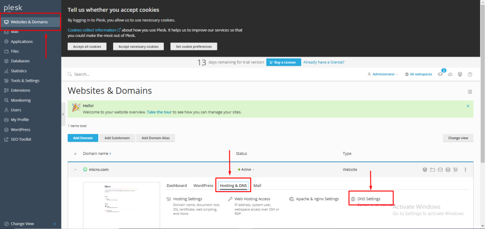
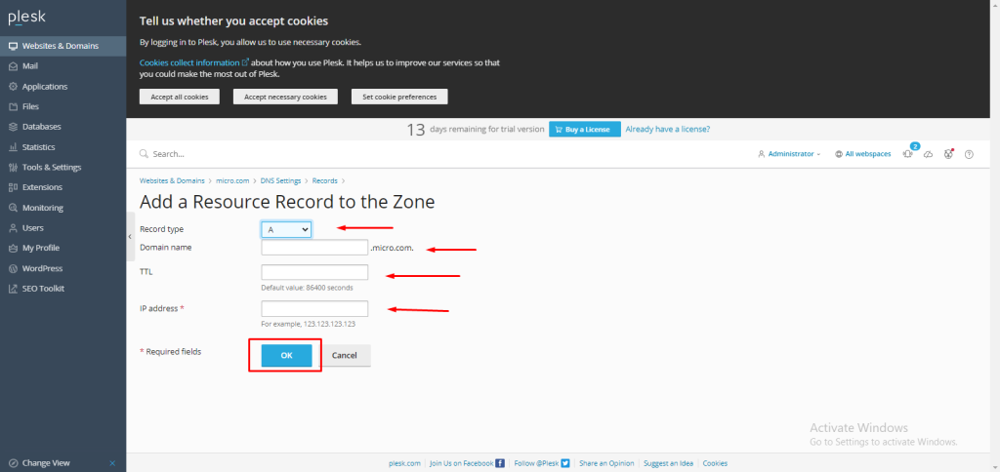

## Introduction

In this article, you will learn how to add A record in Plesk.

This is the most basic form of [DNS](https://en.wikipedia.org/wiki/Domain_Name_System) record, and it is denoted by the letter "A," which stands for the word "address." It provides the IP address of a certain domain.

Step 1. Log into your Plesk with your server password by searching server\_ip:8880 in your browser.

Step 2. Go to Hosting and DNS under the menu of websites and domains, then click on DNS settings.

Step 3. Click on "Add Record."

Step 4. Select "A record" from the record type drop-down menu.

Because we do not have any subdomains, we leave the domain name field empty for the main domain, micro.com.

In the TTL field, you can assign any value in seconds; we have entered 3600.

In the "IP Address" field, enter the IP address of your server, then click "OK."

NOTE: Use your main domain instead of micro.com.

## Conclusion

Hopefully, now you have learned how to add A record in Plesk.

Also read: [How to add MX record in Plesk.](https://utho.com/docs/tutorial/how-to-add-mx-record-in-plesk/)

Thank You 🙂
