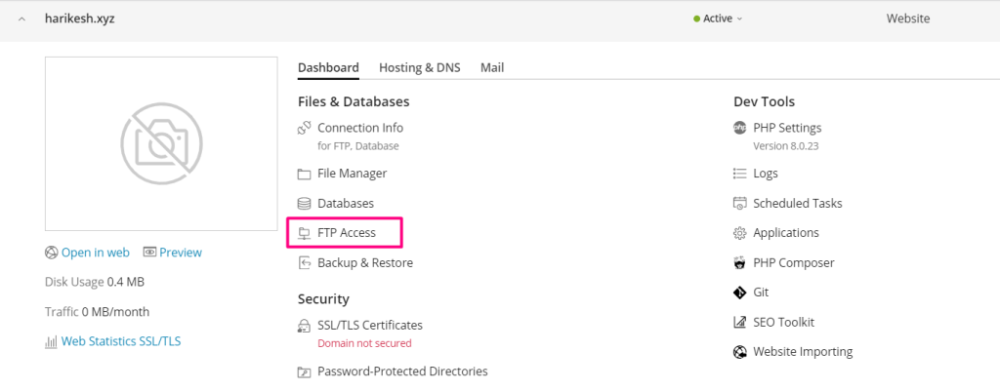

###### **Introduction**

The abbreviation "[FTP](https://en.wikipedia.org/wiki/File_Transfer_Protocol)" stands for "File Transfer Protocol," which is the name given to a set of guidelines that determine how files are transferred between computer systems using the internet. File Transfer Protocol (FTP) is used by businesses to transfer files between computers, and websites use FTP to upload and download files from the servers that host their websites.

\*If you and another person are working on your website together or if you host subdomains for other users, you may want to create separate FTP accounts for each of those parties.

## \*To create an additional account for the File Transfer Protocol:

1.Go to Websites & Domains

2.click **FTP Access**.

3.Click add an **FTP account**

4.Click **Add FTP Account**.

5.Fill the required filled and then click ok

**\*Now, take the next step.**

## 1.Go to Websites & Domains

You'll find this button over on the left side of the page.

\*After that, pick the name of the domain to which you wish to create an FTP account.

## 2.click FTP Access.

## 3.Click add an FTP account

## 5.Fill the required filled and then click ok

\*as you can see in the picture below, the FTP account has now been established successfully.

Hopefully now you will get how to add FTP account in [plesk](https://utho.com/docs/tutorial/how-to-create-an-email-account-in-plesk-and-set-email-forwarding/)

**Thank You**
