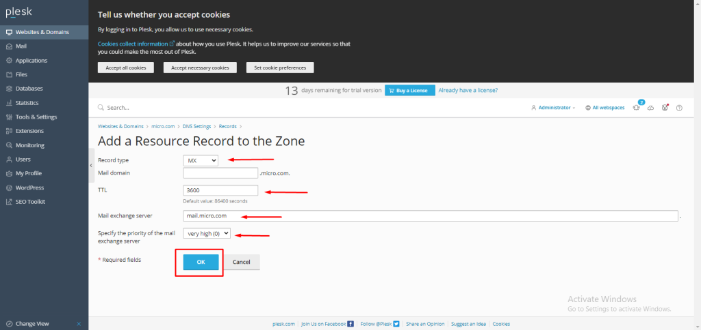

## Introduction

In this article, you will learn how to add MX record in Plesk.

A mail exchanger record, also known as an MX record, details the email server that should be contacted to receive email messages on behalf of a certain domain name. In the Domain Name System, it is referred to as a resource record ([DNS](https://en.wikipedia.org/wiki/Domain_Name_System)). It is possible to setup many MX records, each of which would normally refer to a different mail server in order to provide load balancing and redundancy.

Step 1. Log into your Plesk with your server password by searching server\_ip:8880 in your browser.

Step 2. Go to Hosting and DNS under the menu of websites and domains, then click on DNS settings.

Step 3. Click on "Add Record."

Step 4. In the record type drop-down menu, select MX record. For the mail domain, we are not using any subdomains, so for the main domain, which is micro.com, we are keeping this field empty.

In the TTL field, you can assign any value in seconds; we have entered 3600.

In the mail exchange server field, enter the mail exchange server name, in our case, mail.micro.com.

These drop-downs were used to specify the priority, with 0 being very high. then select OK. 

NOTE: Use your main domain instead of micro.com.

## Conclusion

Hopefully, now you have learned how to add MX record in Plesk.

Also read: [How to add A record in Plesk.](https://utho.com/docs/tutorial/how-to-add-a-record-in-plesk/)

Thank You 🙂
