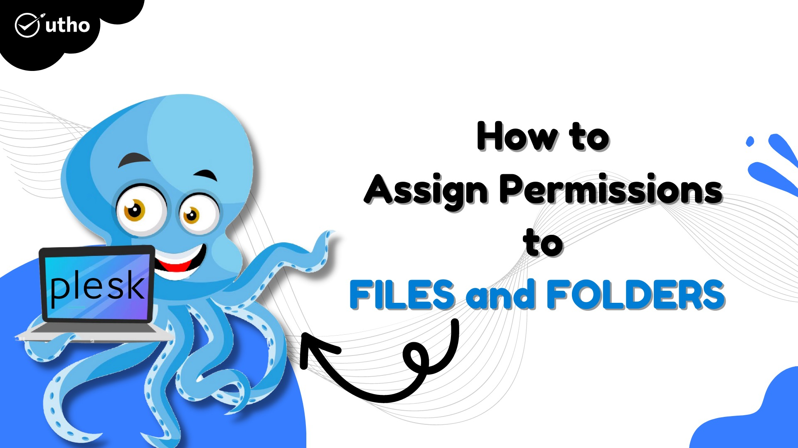
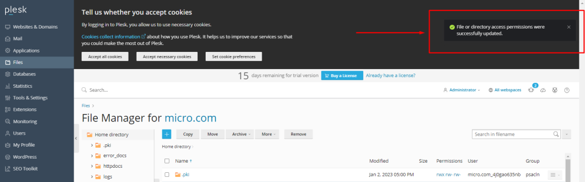

## Introduction

In this article, you will learn how to assign permissions to Files and Folders in Plesk.

Step 1. Log into your [Plesk](https://en.wikipedia.org/wiki/Plesk) with your server password by searching server\_ip:8880 in your browser.

Step 2. Step 2. On the left side of the screen, select Files. 

Step 3. Select any file on which you want to change permissions and click the right-side drop-down menu, then click on [change permission](https://utho.com/docs/tutorial/how-to-change-your-plesk-password/).

Step 4. Change the file permissions to your liking, then save. 

Step 5. Now you will get a success message.

## Conclusion

Hopefully, now you have learned how to assign permissions to Files and Folders in Plesk.

Also Read: [How to add components in Plesk](https://utho.com/docs/tutorial/how-to-add-or-remove-components-in-plesk/)

Thank You 🙂
