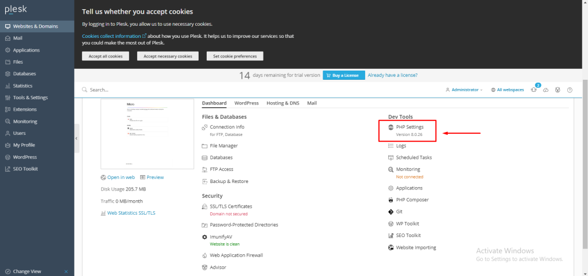
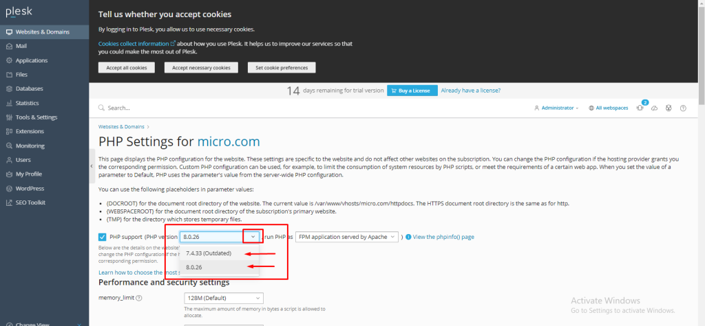
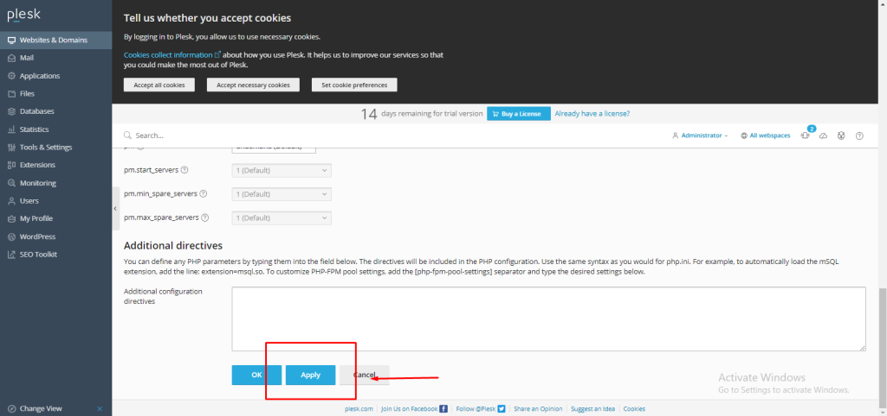
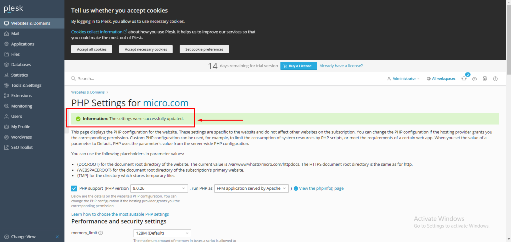

## Introduction

In this article, you will learn how to change the PHP version on [Plesk](https://en.wikipedia.org/wiki/Plesk).

Step 1. Log into your Plesk with your server password by searching server\_ip:8880 in your browser.

Step 2. select website and domains 

Step 3. Select PHP settings. 

Step 4. Drop down the menu and select the [PHP](https://utho.com/docs/tutorial/how-to-change-php-parameter-manually-through-plesk/) version you want to update for the domain.

Step 5. Scroll down the page and press the "apply" button to save the changes. 

Step 6. And then you will get a success message.

## Conclusion

Hopefully, now you have learned how to change the PHP version on Plesk.

Thank You 🙂
