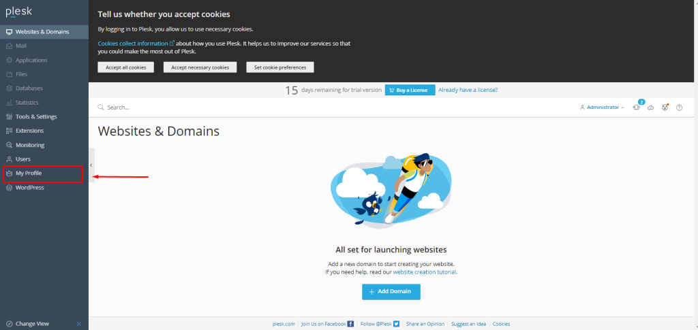

## Introduction

In this article, you will learn how to change your Plesk password.

Step 1. Log into your [Plesk](https://en.wikipedia.org/wiki/Plesk) with your server password by searching server\_ip:8880 in your browser.

Step 2. Go to the "My Profile" option, which is on the left side of the screen.

Step 3. Click on "generate," copy and paste the new password into Notepad, and then click on "apply" to use the new password. 

Step 4. Then you will get a success message, and now you are able to login to your Plesk with a new password.

## Conclusion

Hopefully, now you have learned how to change your Plesk password.

Also read: [How to create a MySQL/MariaDB Database and Database User in Plesk](https://utho.com/docs/tutorial/how-to-create-a-mysql-mariadb-database-and-database-user-in-plesk%ef%bf%bc/)

Thank You 🙂
