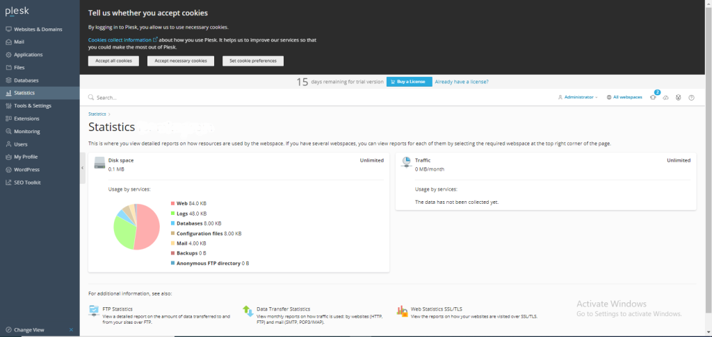

## Introduction

In this article, you will learn how to check current Disk Space in Plesk.

Step 1. Enter your server password to get into your [Plesk](https://en.wikipedia.org/wiki/Plesk) account, which can be found by searching your browser for server ip:8880.

Step 2. Choose Statistics from the menu that appears on the left side of the screen.

Step 3. Now you can see how many people have reached your [website](https://utho.com/docs/tutorial/how-to-add-mx-record-in-plesk/) in a month, **et cetera.**

## Conclusion

Hopefully, now you have learned how to check current Disk Space in Plesk.

Thank You 🙂
