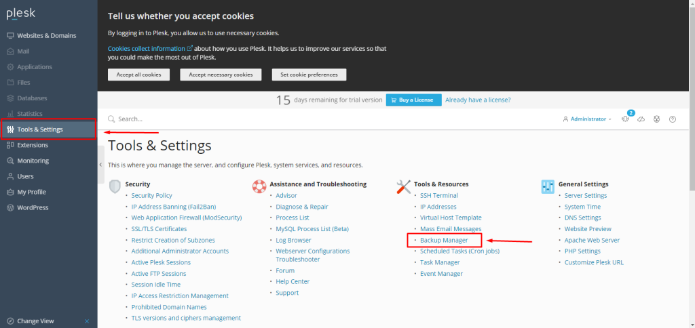
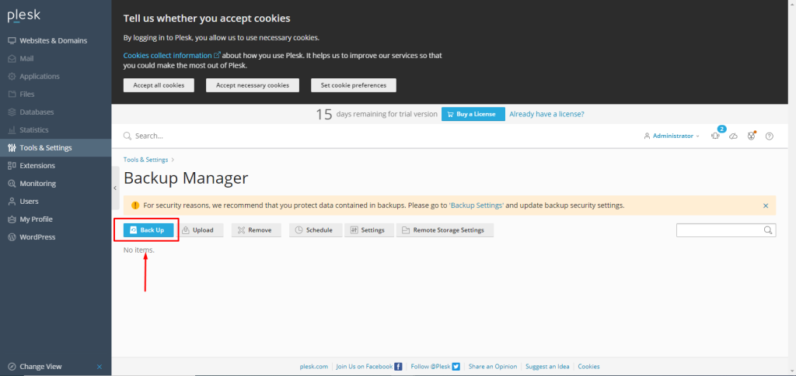
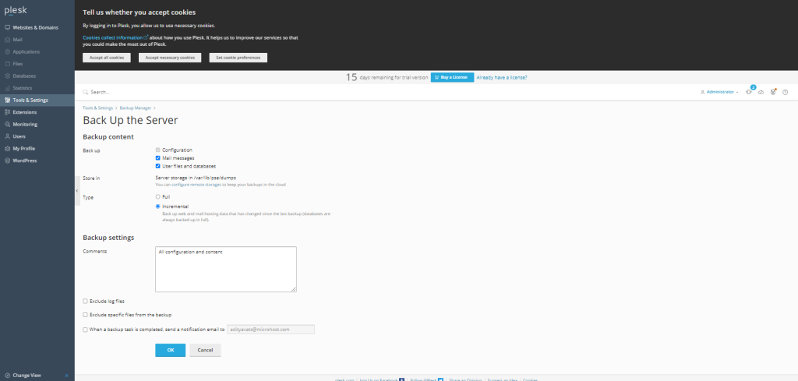

## Introduction

In this article, you will learn how to create a backup in Plesk.

Step 1. Log into your [Plesk](https://en.wikipedia.org/wiki/Plesk) with your server password by searching server\_ip:8880 in your browser.

Step 2. Click on Tools and Settings, which is on the left side of the screen, then click on [Backup](https://utho.com/docs/tutorial/how-to-export-and-import-database-dumps-in-plesk/) Manager.

Step 3. Click on "Back up."

Step 4. Select the options as per your own, then click on "OK" to complete the backup process. Please wait for the backup process to complete.

Step 5. Now you are able to see your backup and the creation date of the backup.

## Conclusion

Hopefully, now you have learned how to create a backup in Plesk.

Thank You 🙂
