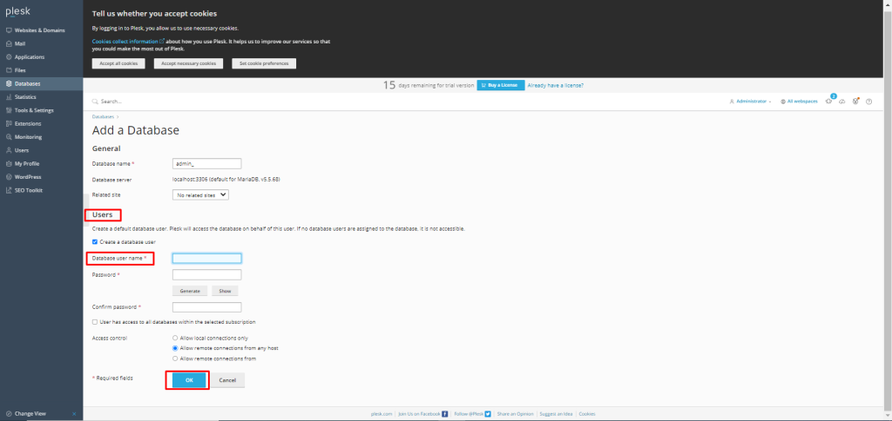
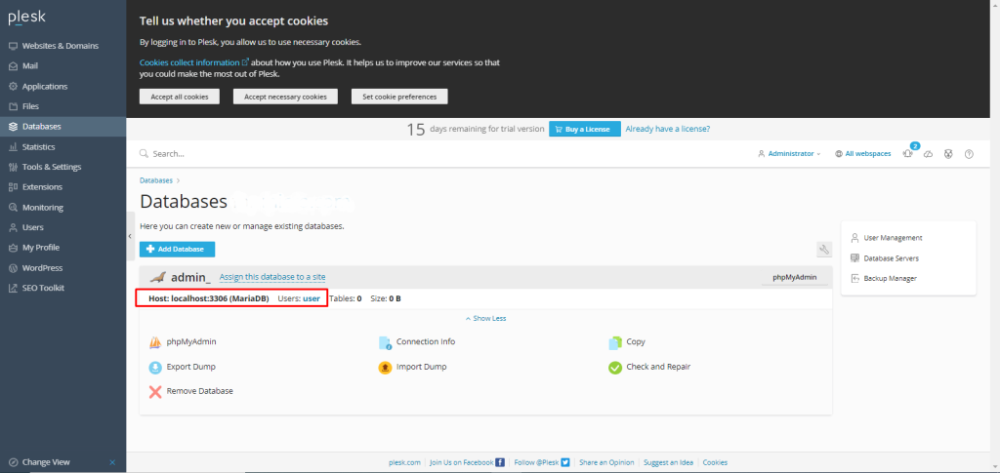

## Introduction

In this article, you will learn how to create a MySQL/MariaDB Database and Database User in [Plesk](https://en.wikipedia.org/wiki/Plesk).

Step 1. Log into your Plesk with your server password by searching server\_ip:8880 in your browser.

Step 2. On the left side of the screen, select "[Database](https://utho.com/docs/tutorial/how-to-export-and-import-database-dumps-in-plesk/)," then select "Add Database." 

Step 3. Fill in the details for the database user name and generated password for the database user, then select your preferred options from the list. Finally, press the OK button. 

Step 4. Now you can see your database user.

## Conclusion

Hopefully, now you have learned how to create a MySQL/MariaDB Database and Database User in Plesk.

Thank You 🙂
