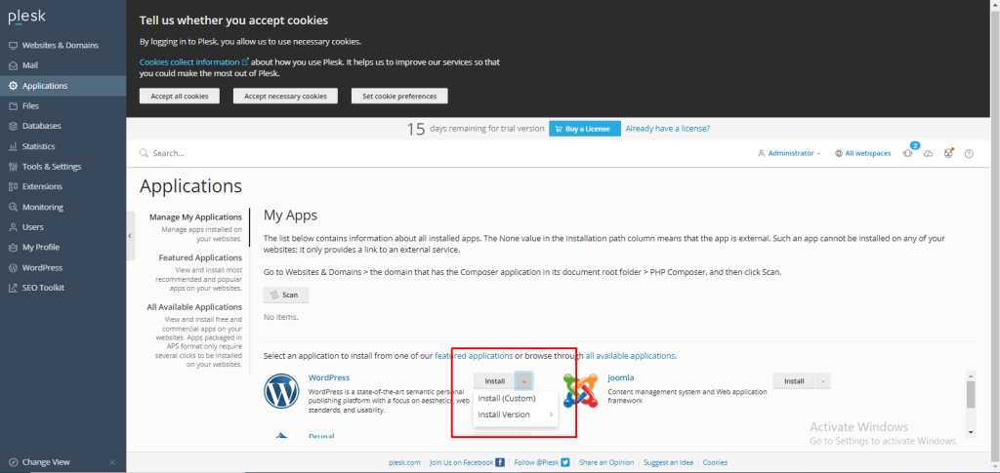
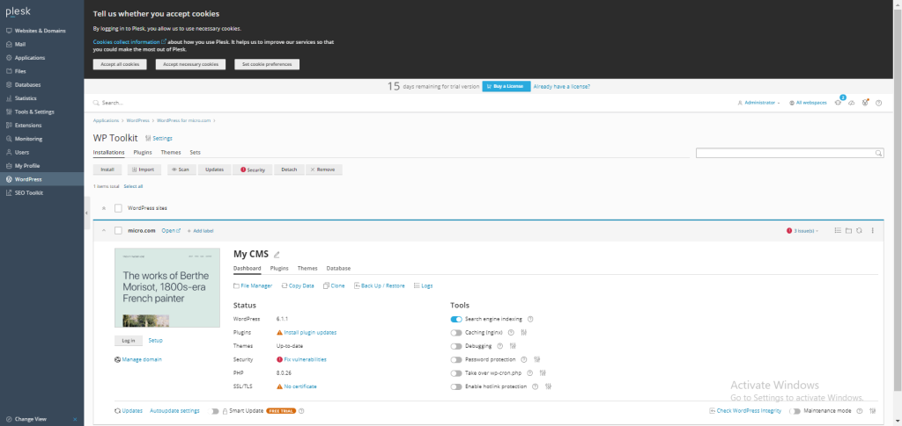

## Introduction

In this article, you will learn how to install WordPress in Plesk.

WordPress is a content management system that is both open-source and free to use. It is developed in the hypertext preprocessor language and can be combined with either a MySQL or MariaDB database. It also supports HTTPS. A plugin architecture and a template system, which are together referred to as "Themes" inside the WordPress platform, are among the features.

Step 1. Log into your [Plesk](https://en.wikipedia.org/wiki/Plesk) with your server password by searching server\_ip:8880 in your browser.

Step 2. Go to the applications option, which is on the left side of the screen.

Step 3. Click on the arrow to the right of install and you will be given two options for installing WordPress: one for custom installation and the other for wordpress versions. 

Step 4. Pick the alternative that best suits your needs, and then start the installation.

Step 5. You have successfully installed WordPress.

## Conclusion

Hopefully, now you have learned how to install WordPress in Plesk.

Also read: [How to install Joomla in Plesk](https://utho.com/docs/tutorial/how-to-install-joomla-in-plesk/)

Thank You 🙂
