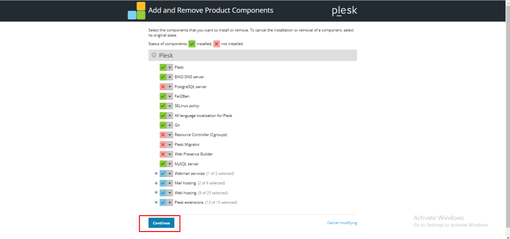

## Introduction

In this article, you will learn how to remove components in [Plesk](https://en.wikipedia.org/wiki/Plesk).

Step 1. Log into your Plesk with your server password by searching server\_ip:8880 in your browser.

Step 2. Click on Tools and Settings, which is on the left side of the screen.

Step 3. Under the PLESK menu, select Updates. 

Step 4. click on [add/remove components](https://utho.com/docs/tutorial/how-to-add-or-remove-components-in-plesk/).

Step 5. Select any component that you want to uninstall, then click on continue.

Step 6. Now that your selected component is uninstalled, click on OK.

## Conclusion

Hopefully, now you have learned how to remove components in Plesk.

Thank You 🙂
