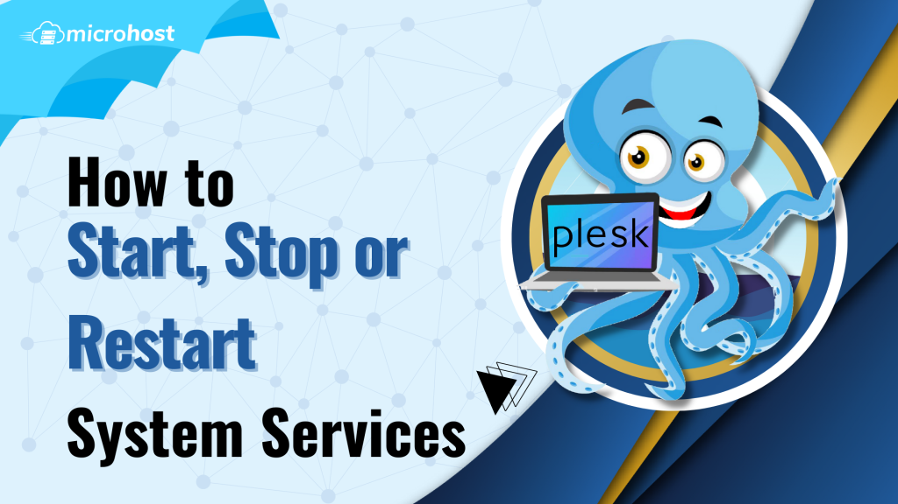

## Introduction

In this article, you will learn how to Start, Stop or Restart System Services in [Plesk](https://en.wikipedia.org/wiki/Plesk).

Step 1. Log into your Plesk with your server password by searching server\_ip:8880 in your browser.

Step 2. Go to [tools and settings](https://utho.com/docs/tutorial/how-to-setup-scheduled-tasks-in-plesk/) on the left side of the screen, then select services management from the server management menu. 

Step 3. Now you are able to restart or stop the services as per your own preferences.

## Conclusion

Hopefully, now you have learned how to Start, Stop or Restart System Services in Plesk.

Thank You 🙂
