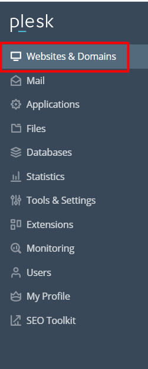
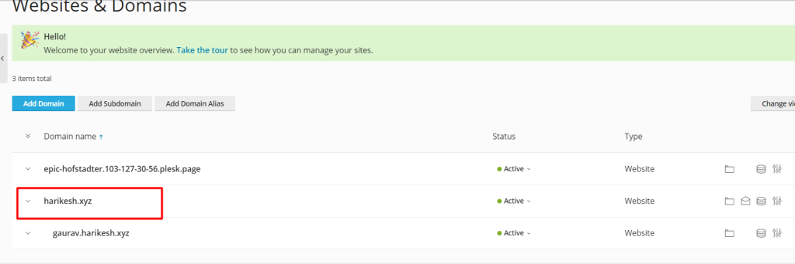

##### Intorduction

The Domain name system, or DNS, is a naming framework that converts human-readable domain names into the numerical strings known as IP addresses that identify web sites. Resolving is the term for this type of translation. Plesk is the only option when adding a domain name (using Websites & Domains > Add Domain) to manage resource resolution. It can fulfil three highly beneficial roles.

## DNS record

DNS records, also known as zone files, are instructions that are stored in authoritative DNS servers. These instructions offer information about a domain, such as what IP address is connected with that domain and how to process requests for that domain. These entries are made up of a string of text files that are produced using DNS syntax. The DNS syntax is nothing more than a string of characters that functions as a set of instructions for the DNS server. Every DNS record also has something called a "TTL," which stands for time-to-live and defines how frequently a DNS server will refresh that record. This value is included in all DNS records.

A collection of DNS records can be compared to a listing for a company on Yelp.com. This directory will provide you with a lot of helpful information about a business, such as its location, hours of operation, and the services that it provides, among other things. There are a number of optional records that can be added to a domain that serve additional purposes. However, in order for a user to reach a website by using the domain name, it is necessary for the domain to include at least a few of the essential DNS records.

**1.Go to Websites & Domains and click on the name of the domain you want to manage the DNS settings for.**

**2.Click on hosting&DNS .**

**3.Click on DNS settings.**

4.**After clicking "add record," you will be brought to a page where you can customise the DNS records to meet your needs.**

**5.Fill in the blanks that need to be filled in, then click ok.**

You can see that the record was successfully updated on the screenshot that was provided earlier.

**\*Steps**\*

## 1.Go to Websites & Domains and click on the name of the domain you want to manage the DNS settings for.

## 2.Click on hosting&DNS .

## 3.Click on DNS settings.

## 4.After clicking "add record," you will be brought to a page where you can customise the DNS records to meet your needs.

**5.Fill in the blanks that need to be filled in, then click ok.**

You can see that the record was successfully updated on the screenshot that was provided earlier.

##### Thank You
