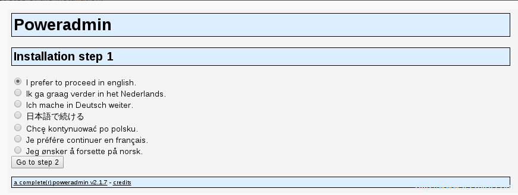
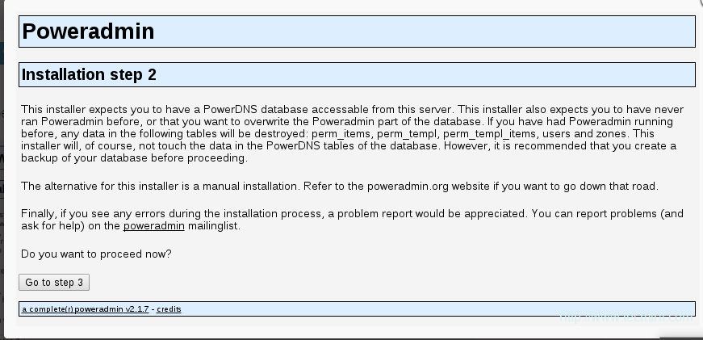
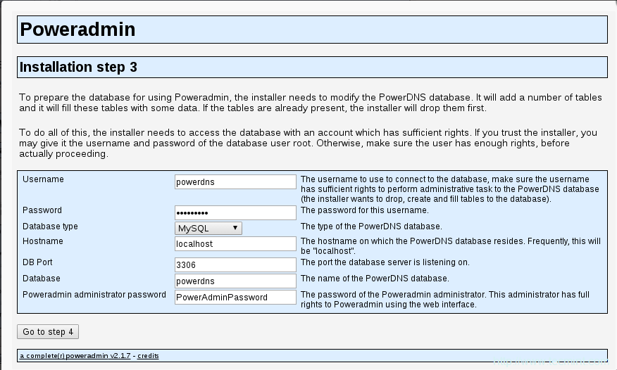
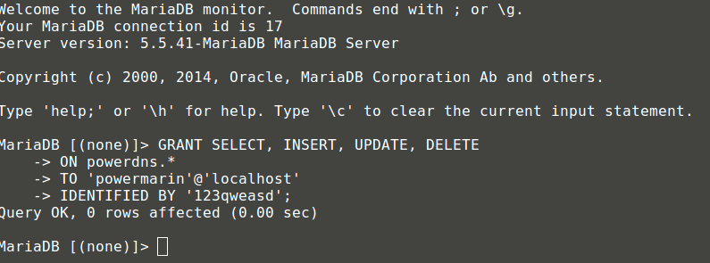
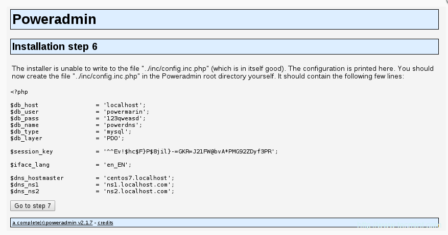
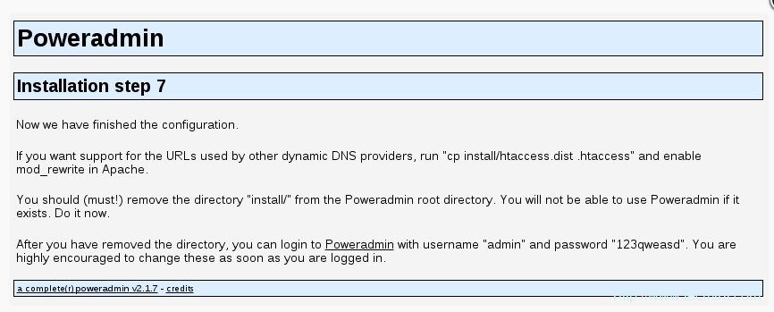
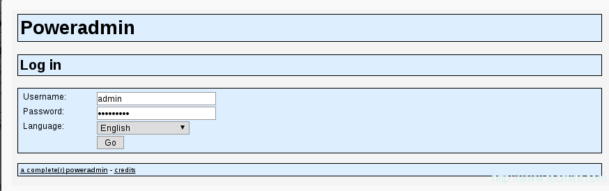

PowerDNS is a DNS server that works on many derivatives from Linux / Unix. It can be configured with various backends, including zone files of the BIND style, relational databases and failover / load balancing. The DNS recurrent can also be set up as part of a separate server process.

PowerDNS Authoritative server's latest version is 3.4.4 but 3.4.3 is currently available in the EPEL. In order to test this version for CentOS and Fedora, I would recommend installing the version for the EPEL repository. You can also update PowerDNS easily in the future in this way.

This article will present you with the MariaDB backend and PowerAdmin-a usable PowerDNS web interface management tool-how you can install and configure the master PowerDNS-Server.

## Installing PowerDNS with MariaDB Backend

You must first allow your server to simply  use the EPEL repository :

```
 [root@Microhost]# yum install epel-release.noarch 
```

Installing the MariaDB Server is the next step. The following command can be easily executed:

```
 [root@Microhost]# yum -y install mariadb-server mariadb 
```

We will configure Mysql as it should be up at system boot time.

```
 [root@Microhost]# systemctl enable mariadb.service 
```

```
 [root@Microhost]# systemctl start mariadb.service 
```

We will execute the secure installation for MariaDB password configuration as following:

```
 [root@Microhost]# mysql_secure_installation 
```

```
 /bin/mysql_secure_installation: line 379: find_mysql_client:

In order to log into MariaDB to secure it, we'll need the current password for the root user. If you've just installed MariaDB, and you haven't set the root password yet, the password will be blank, so you should just press enter here.

Enter current password for root (enter for none): Press ENTER OK, successfully used password, moving on…

Setting the root password ensures that nobody can log into the MariaDB root user without the proper authorisation.

Set root password? [Y/n] y New password: ← Set New Password Re-enter new password: ← Repeat Above Password Password updated successfully! Reloading privilege tables.. … Success!

By default, a MariaDB installation has an anonymous user, allowing anyone to log into MariaDB without having to have a user account created for them. This is intended only for testing, and to make the installation go a bit smoother. You should remove them before moving into a production environment.

Remove anonymous users? [Y/n] y ← Enter “y” to disable that user … Success!

Normally, root should only be allowed to connect from 'localhost'. This ensures that someone cannot guess at the root password from the network.

Disallow root login remotely? [Y/n] n ← Enter “n” for no … skipping.

By default, MariaDB comes with a database named 'test' that anyone can access. This is also intended only for testing, and should be removed before moving into a production environment.

Remove test database and access to it? [Y/n] y ← Enter “y” for yes

- Dropping test database… … Success!
- Removing privileges on test database… … Success!

Reloading the privilege tables will ensure that all changes made so far will take effect immediately.

Reload privilege tables now? [Y/n] y ← Enter “y” for yes … Success!

Cleaning up…

All done! If you've completed all of the above steps, your MariaDB installation should now be secure.

Thanks for using MariaDB! 
```

Now MariaDB configuration has been completed. We will proceed for the installation of PowerDNS:

```
 [root@Microhost]# yum -y install pdns pdns-backend-mysql 
```

The PowerDNS configuration file lists /etc/pdns/pdns, but a MySQL database for PowerDNS service is configured before editing. We first log on to the MySQL server and build a powerdns named database:

```
 [root@Microhost]# # mysql -u root -p MariaDB [(none)]> CREATE DATABASE powerdns; 
```

Now we create the database user as following:

```
 MariaDB [(none)]> GRANT ALL ON powerdns.* TO 'powerdns'@'localhost' IDENTIFIED BY 'COMPLX_Password'; MariaDB [(none)]> GRANT ALL ON powerdns.* TO 'powerdns'@'centos7.localdomain' IDENTIFIED BY 'COMPLX_Password'; MariaDB [(none)]> FLUSH PRIVILEGES; 
```

Replace COMPLEX\_Password with your password:

We will create database tables which will be used in future by powerdns:

```
 MMariaDB [(none)]> USE powerdns; MariaDB [(none)]> CREATE TABLE domains ( id INT auto_increment, name VARCHAR(255) NOT NULL, master VARCHAR(128) DEFAULT NULL, last_check INT DEFAULT NULL, type VARCHAR(6) NOT NULL, notified_serial INT DEFAULT NULL, account VARCHAR(40) DEFAULT NULL, primary key (id) ); 
```

```
 MariaDB [(none)]> CREATE UNIQUE INDEX name_index ON domains(name); MariaDB [(none)]> CREATE TABLE records ( id INT auto_increment, domain_id INT DEFAULT NULL, name VARCHAR(255) DEFAULT NULL, type VARCHAR(6) DEFAULT NULL, content VARCHAR(255) DEFAULT NULL, ttl INT DEFAULT NULL, prio INT DEFAULT NULL, change_date INT DEFAULT NULL, primary key(id) ); 
```

```
MariaDB [(none)]> CREATE INDEX rec_name_index ON records(name); MariaDB [(none)]> CREATE INDEX nametype_index ON records(name,type); MariaDB [(none)]> CREATE INDEX domain_id ON records(domain_id); 
```

```
MariaDB [(none)]> CREATE TABLE supermasters ( ip VARCHAR(25) NOT NULL, nameserver VARCHAR(255) NOT NULL, account VARCHAR(40) DEFAULT NULL ); 
```

Now exit from Mysql:

```
MariaDB [(none)]> quit; 
```

We can finally configure our PowerDNS so that it uses MySQL as a backend.

Open the configuration file of PowerDNS located at:

```
vi /etc/pdns/pdns.conf 
```

It will look like:

```
#################################
```
launch        Which backends to launch and order to query them in
```#
```
launch=
```
Copy the below codes and put at the end of the file:

```
launch=gmysql
gmysql-host=localhost
gmysql-user=powerdns
gmysql-password=COMPLEX_Password
gmysql-dbname=powerdns
```

The password "COMPLEX\_Password" should be the same as previous one.

Save the file with **:wq** and exit from the text editor.

Now we will start and enable the service of Powerdns as following:

```
 [root@Microhost]# systemctl enable pdns.service 
```

```
 [root@Microhost]# systemctl start pdns.service 
```

## Installing PowerAdmin console to Manage PowerDNS

PowerAdmin – a friendly Web interface designed to manage PowerDNS servers, is now being installed. We have to install PHP and a web server (Apache) because it is written in PHP.

```
 [root@Microhost]# yum install httpd php php-devel php-gd php-imap php-ldap php-mysql php-odbc php-pear php-xml php-xmlrpc php-mbstring php-mcrypt php-mhash gettext 
```

Two PEAR packages are also required for PowerAdmin:

```
 [root@Microhost]# yum -y install php-pear-DB php-pear-MDB2-Driver-mysql 
```

After the installation has been completed, Apache is started and set to start when the system boots:

```
 [root@Microhost]# systemctl enable httpd.service 
```

```
 [root@Microhost]# systemctl start httpd.service 
```

We can proceed and download the package of poweradmin console now that all the system requirements for PowerAdmin are done. Since /var/www/html is Apache's default web directory, the package will be downloaded there.

```
 [root@Microhost]# cd /var/www/html/ 
```

Now we will download the packages using Wget as following

```
 [root@Microhost]# wget http://downloads.sourceforge.net/project/poweradmin/poweradmin-2.1.7.tgz 
```

Zip file has been downloaded now. We have to extract the zip file as following:

```
 [root@Microhost]# tar xfv poweradmin-2.1.7.tgz 
```

Now we will rename the directory name as poweradmin as following:

```
 [root@Microhost]# mv poweradmin-2.1.7.tgz poweradmin 
```

We can now launch PowerAdmin's web installer while accessing the URL:

http://IP\_address/poweradmin/install/

The output will be shown as below:



The above page requires you to select the PowerAdmin language. Choose the one you want and then click on the 'Go To Step 2'. The output will be shown as below:

The installer expects that you have already created the PowerDNS .



We can move on to the next step since we have already created one. The database details you set up earlier, will be requested. Poweradmin administrator password is also necessary:



Go to step 4 once you've entered them. You are going to create a new user with limited Poweradmin rights. You will have to enter the following fields:

- Username - PowerAdmin username.
- Password – The user's password.
- Hostmaster – This value will be used when you create SOA records and do not have the hostmaster specified.
- Primary name server- The value will be used to create new DNS zones as primary name server.
- Secondary name server – The value is used to generate new DNS zones as the primary name server.


The next step will be to ask Poweradmin to create a new user database with limited rights in database tables. The code you need to put in a MySQL console is given below:


Now login to MySQL database on server using below command:

```
 [root@Microhost]# mysql -u root -p 
```

Now execute the code provided by the Poweadin console:

```
 [root@Microhost]# MariaDB [(none)]> GRANT SELECT, INSERT, UPDATE, DELETE ON powerdns.* TO 'powermarin'@'localhost' IDENTIFIED BY '123qweasd'; 
```



Now go to redirect to the path **/var/www/html/poweradmin/inc**. We have to create a file named **config.inc.php** using below command:

```
 [root@Microhost]# vi /var/www/html/poweradmin/inc/config.inc.php 
```



Now copy all the content of above mentioned image and paste it to file **config.inc.php**

Go to the last page where the installation has been finished and you will receive information on accessing the installation of your Poweradmin.



URLs of other DNS providers can be activated by execution.

```
 [root@Microhost]# cp install/htaccess.dist .htaccess 
```

It is important to rename or remove the install directory from the poweradmin folder:

```
 [root@Microhost]# mv /var/www/html/poweradmin/install/ /var/www/html/poweradmin/donotinstall/ 
```

Now configuration has been successfully completed. We can access the Poweradmin using Url:

```
http://IP_address/poweradmin/
```



After login, you can see the main page as following


Now you can proceed to add Master Zone as per your requirement.

Thank You :)
