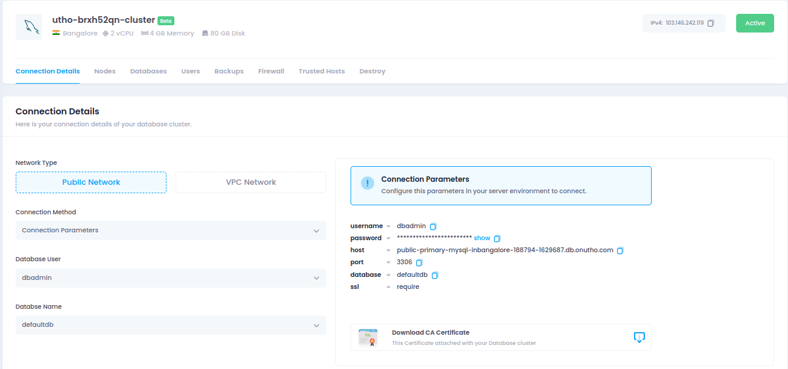
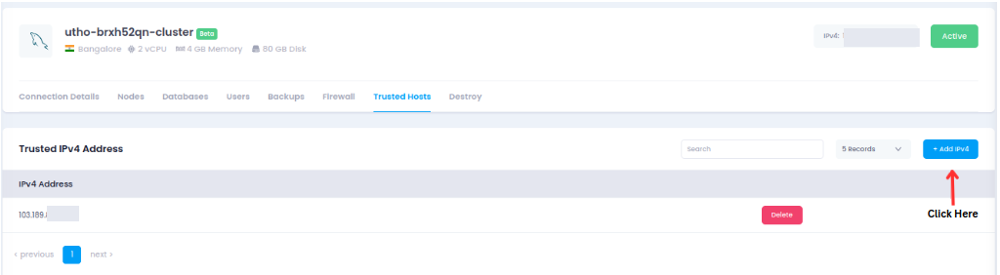
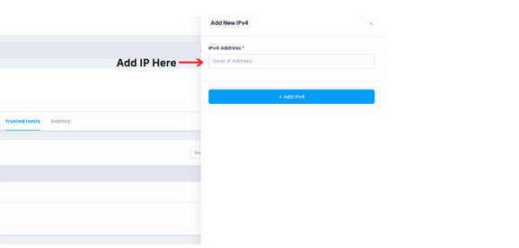
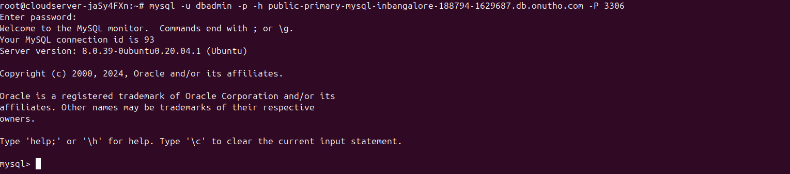

---

title: "How to Connect using MySQL Client with Utho's Managed MYSQL DataBase"
date: "2024-11-26"
title_meta: "How to Connect using MySQL Client with Utho's Managed MYSQL DataBase"
description: "Learn how to deploy, connect, and manage a MySQL database using a managed interface. This guide covers trusted host setup, connecting with MySQL client, user and database management, creating backups, setting up firewalls, and securely deleting databases. Perfect for simplifying database management while ensuring security and scalability."
keywords: ["Deploy MySQL Database", "Connect to MySQL", "Managed MySQL", "Database Firewall", "MySQL Backup", "Database User Management"]
tags: ["MySQL", "Database Management", "Managed Database", "Firewall Protection", "Database Backups", "Utho Cloud","Utho Cloud Databases"]
icon: "Databases"
lastmod: "2024-11-26T10:00:00+00:00"
draft: false
weight: 1
toc: true
tab: true

---

## **How to Connect using MySQL Client with Utho's Managed MYSQL DataBase**

This document provides a step-by-step guide on how to configure and connect to a managed MySQL database.

---

### **Prerequisites**
- Access to the **Utho Cloud UI**.
- Need **MYSQL Manage DataBase**.  

---

### **Deployment Steps**

This is the Utho manage Database interface where you can view the MySQL
databases.



You need to add a trusted host to your managed MySQL database.

-   Click on **Add IPV4**



-   After that add your IP in I**PV4 Address.**




## **Connecting to MySQL Managed Database**

### **1. Install MySQL Client**

Ensure the MySQL client is installed on your Ubuntu machine.
```
sudo apt update
```

```
sudo apt install -y mysql-client 
```
### **2. Obtain Database Details**

Get the following information from your managed MySQL database provider:

-   Hostname or IP address

-   Port (default: 3306)

-   Username

-   Password

-   Database name (optional)

### 

### 

### **3. Connect Using MySQL Client**

Use the mysql command to connect:
```
mysql -u \<username\> -p -h \<hostname\> -P \<port\>
```



-   Replace **\<username\>** with the database user.

-   Replace **\<hostname\>** with the managed database host (e.g.: > db.example.com).

-   Replace **\<port\>** with the port number (default is 3306).

-   You\'ll be prompted to enter your password.

