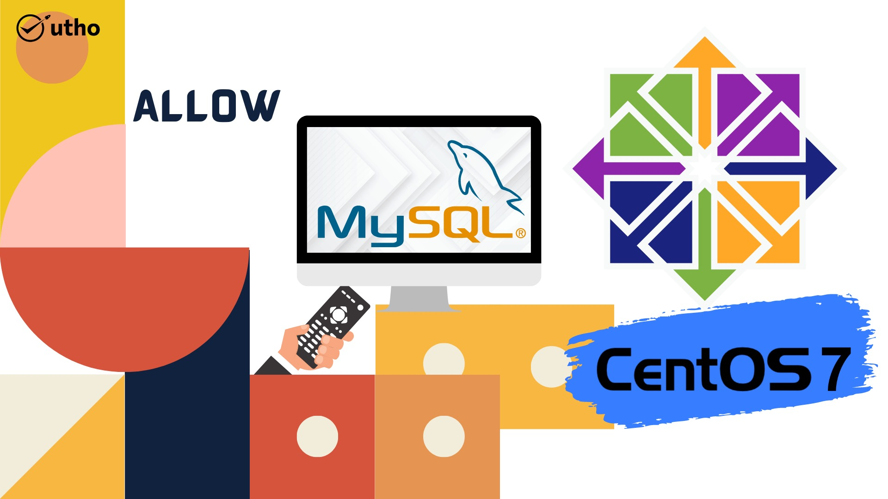
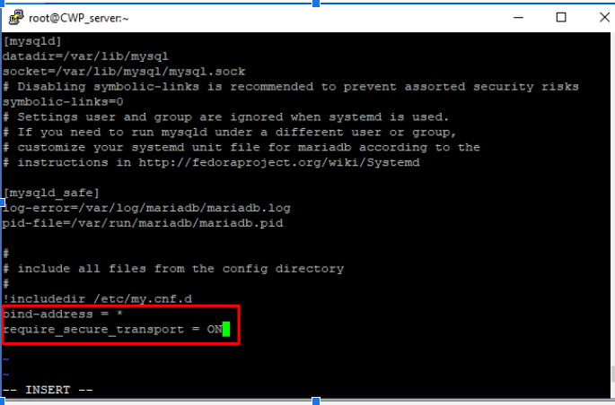

**Introduction**

On the same local system, databases and web servers are frequently hosted. But a lot of businesses are now switching to a more distributed environment.

You may grow resources fast and improve hardware performance and security by using a separate database server. Learning how to manage remote resources efficiently is a priority in such use situations.

This guide demonstrates how to make a [MySQL](https://en.wikipedia.org/wiki/MySQL) database accessible from a distance.

To Allow Remote Connections to MySQL in centos so follow the below steps..

**Step.1** You must begin by editing the file that is used to configure MySQL. Launch your text editor of choice, which in our case is vi, and open the file:

```
#vi /etc/my.cnf
```


Add the following contents at the end of the ‘\[mysqld\]‘ section:  
bind-address = \*  
require\_secure\_transport = ON  
When you are done, save and close the file.



**Step.2**  
Then, restart MySQL service on Centos to apply the changes:

```
#systemctl restart mysqld  

```

**Step.3**  
If you are useing a firewall then add the 3306 in firewall rules

To allow MySQL to connect from remote server on CentOS 7 server, you need to enable port 3306 in firewall.

```
#sudo firewall-cmd --zone=public --add-port=3306/tcp  

```

```
#sudo firewall-cmd –reload
```

**Step.4** Now you can access the mysql database.using below command.give the password and enter.

```
#mysql -u root -u
```


Hosting for databases and web servers frequently takes place on the same physical machine. However, many companies are making the transition to a more decentralised setting as of late.

I am hoping that you are able to follow the steps. The Step-by-Step Guide to Enabling Remote MySQL Connections on CentOS

Must read:- [https://utho.com/docs/tutorial/change-ssh-default-port-22-to-custom-port/](https://utho.com/docs/tutorial/change-ssh-default-port-22-to-custom-port/)

**Thankyou**
