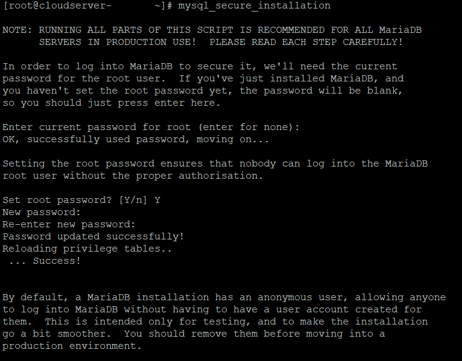
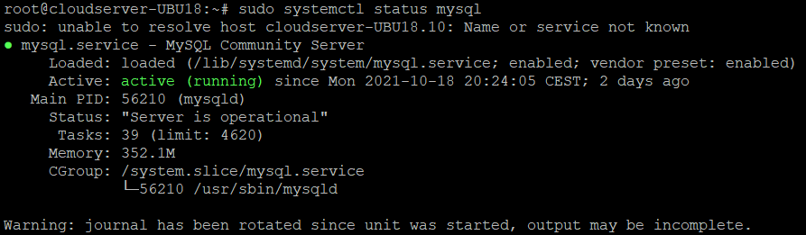
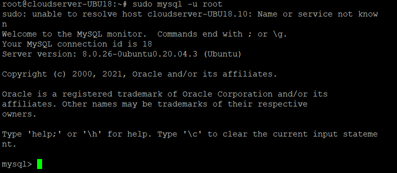

MySQL is one of the most popular and widely used open-source relational database management systems.  
Hosting MySQL databases on Ubuntu 20.04 requires installing the MySQL Server package.

**Step 1. Login to your server via SSH Putty**


**Step 2.  Update/Upgrade Package Repository by running the command**

```
 # sudo apt update 
```

**Step 3. Install MySQL by running the following command**

```
 # sudo apt install mysql-server 
```

When asked if you want to continue with the installation, answer `Y` and hit ENTER.  
The system downloads MySQL packages and installs them on your machine.

**Step 4. Check if MySQL was successfully installed by running:**

```
 # mysql --version 
```


The output shows which version of MySQL is installed on the machine.  

**Step 5.  Secure your MySQL user account with password authentication by running the included security script:**

```
 # sudo mysql_secure_installation 
```



Enter your password and answer `Y` when asked if you want to continue setting up the `VALIDATE PASSWORD` component. The component checks to see if the new password is strong enough.

Choose one of the three levels of password validation:

- `0` - Low. A password containing at least 8 characters.
- `1` - Medium. A password containing at least 8 characters, including numeric, mixed case characters, and special characters.
- `2` - Strong. A password containing at least 8 characters, including numeric, mixed case characters, and special characters, and compares the password to a dictionary file.

Enter `0`, `1`, or `2` depending on the password strength you want to set. The script then instructs you to enter your password and re-enter it afterward to confirm.

Any subsequent MySQL user passwords need to match your selected password strength.

The program estimates the strength of your password and requires confirmation to continue.

Press `Y` if you are happy with the password or any other key if you want a different one.

**Step 6.  The script then prompts for the following security features:**

- Remove anonymous users?
- Disallow root login remotely?
- Remove test database and access to it?
- Reload privilege tables now?

The recommended answer to all these questions is `Y`. However, if you want a different setting for any reason, enter any other key.  
  


**Step 7.  Upon successfully installing MySQL, the MySQL service starts automatically.**

Verify that the MySQL server is running by running:  
  
```
 # sudo systemctl status mysql 
```



The output above shows that the service is operational and running.

**Step 8.  Finally, to log in to the MySQL interface, run the following command:**

```
 # sudo mysql -u root 
```



Now you can execute queries, create databases, and test out your new MySQL setup.

Please find a link below to have a look at some important MySQL commands.LINK:  [https://phoenixnap.com/kb/mysql-commands-cheat-sheet](https://phoenixnap.com/kb/mysql-commands-cheat-sheet)

You now have a fully functioning MySQL server installed on your machine.

Thank You.
