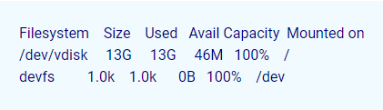

## Introduction

In this article, you have how to resolve [Mysql](https://en.wikipedia.org/wiki/MySQL) 1030 got error 28 from storage engine.

If you have any experience hosting MySQL systems, you have most likely run into the following error at some point. The following are some suggestions for how to correct it.

Error 28 is a message that frequently appears when you use MySQL as your storage engine. This message indicates that the drive is full, which means that one or more of the partitions on your server have run out of space, and MySQL is unable to write to the disc as a result. In order for MySQL to run, you will need to free up space on your disc.

It's possible that the query you ran caused MySQL to generate some temporary tables. In the default configuration, these tables will be created along with the other tables. This means that they will most likely be stored on your / partition, which only has 1.6 GB of free space remaining, despite the fact that these tables have the potential to grow much larger than that very quickly.

Solution 1.

**Insufficient disc space is the cause of [MySQL](https://utho.com/docs/tutorial/how-do-we-install-mysql-workbench-on-ubuntu-18-04/) error "28 from storage engine**."

Use the following command to display available disc space.

```
#df -h
```

**This is how the results must be**.



Solution 2.

**The amount of available storage space must be increased, or unnecessary files must be deleted**.

Solution 3.

**Remove Items from the Temporary Directories**

Switch to the /var/tmp folder.

```
#cd /var/tmp
```

**Deleting everything in the current directory and its subfolders**.

```
#rm -rf *
```

**Or you can remove the files that are not useful to you, by the command**:

```
#rm -rf filename
```

Solution 4.

**Explore the contents of /backup to discover if an unnecessary backup may be removed**.

## conclusion

Hopefully, you now understand how to resolve [Mysql](https://en.wikipedia.org/wiki/MySQL) 1030 got error 28 from storage engine.

Thank You 🙂
