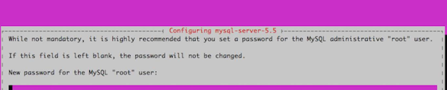

###### \***Introduction**

MySQL is a relational database management system that is available for free online. You can say it like this: ([RDBMS](https://en.wikipedia.org/wiki/Relational_database)). The name comes from the combination of "My," which is the name of co-founder Michael Widenius's daughter, and the acronym for Structured Query Language ([SQL](https://utho.com/docs/tutorial/how-to-start-stop-and-restart-mysql-server-on-centos-7/)).

Web and server applications frequently use the well-liked database management system MySQL.

Installing, configuring, and managing MySQL will be covered in detail in this guide.

## \*Installing MySQL

```
#sudo apt-get install mysql-server
```

During installation, you'll be prompted to set a MySQL root password. Keep your password safe.



## \*MySQL Server secure installation

```
#sudo mysql_secure_installation
```

You can change MySQL's root password, remove anonymous user accounts, disable root database login outside localhost, and delete test databases. Yes is recommended. The MySQL Reference Manual has more details.

## \*Root Login

```
#mysql -u root -p
```

\*After run this command you will face below interface

```
mysql>
```

## \*Make a New User in MySQL and Database

```
#create database microhostdb;
```

```
#create user 'microhost'@localhost identified by 'password';
```

```
#grant all on microhostdb.* to 'microhost';
```

\*Creating the user and assigning database access privileges at the same time can speed up the process significantly:

```
#create database microhostdb;
```

```
#grant all on microhostdb.* to 'microhost' identified by 'password';
```

```
#exit
```

## \*Produce a Model of the Table.

```
#mysql -u microhost -p
```

```
#use microhostdb;
```

```
#create table customers (customer_id INT NOT NULL AUTO_INCREMENT PRIMARY KEY, first_name TEXT, last_name TEXT);
```

```
#exit
```

## \*Password-reset MySQL root user

You can reset your root MySQL password if you forget it.

\*Stop the currently running MySQL server.

```
#sudo service mysql stop
```

\*Use dpkg to re-run the setup process that MySQL goes through the first time it is installed. You'll be asked to set a root password once more.

```
#sudo dpkg-reconfigure mysql-server-5.5
```

\*You should now be able to log in once more by using the command mysql -u root -p.

## \*Tune MySQL

\*From Ubuntu's software repositories, install MySQL Tuner.

```
#sudo apt-get install mysqltuner
```

\*To operate it:

```
#mysqltuner
```

The output will include two sections of interest: general recommendations and variables to tweak.

##### Thank You
