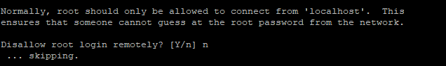

## Introduction

In this article you will learn how to install MariaDB 10.7 on Fedora.

This is to install the latest MariaDB on a Fedora server. MariaDB is a database management system that is a fork of MySQL. It is extremely similar to MySQL, which is a database management system. Several different applications, including data warehousing, e-commerce, enterprise-level features, and logging programmes, all make use of the MariaDB database.

[MariaDB](https://en.wikipedia.org/wiki/MariaDB) will let you to fulfil all of your burden in an effective manner; it can function in any cloud database and can function at any scale, whether it be little or huge.

A database is a repository for information that can be easily retrieved and applied in the context in which it is required. When compared to recording information on a piece of paper or in a Word document, storing all of your information in a database allows it to be organized into tables, making it simple to retrieve each individual entry in a manner that is both systematic and accurate.

## You should confirm that your Fedora operating system is up to date by performing an update on all of the existing packages:

```
# sudo dnf upgrade --refresh -y
```

## Install Dependency Required

Execute the following command in order to install or verify that the package dnf-plugins-core is installed on your Fedora desktop computer before continuing with the installation process.

```
# sudo dnf install dnf-plugins-core -y
```

This function should be installed automatically.

## Install MariaDB 10.7 on Fedora

This need to be the default setting. There is a default installation of MariaDB 10.7 in the Fedora repository. Having said that, you will have to enable it. To achieve this, you must first print out a list of the different versions of MariaDB that are available. installed.

```
# sudo dnf module list mariadb
```


As was previously mentioned, the default repository version is 10.5. On the other hand, versions 10.6 and 10.7 are accessible. The following command must be executed in order to enable version 10.7 of the MariaDB series.

```
# sudo dnf module enable mariadb:10.7 -y
```


Execute the following commands in order to continue with the installation of MariaDB in your terminal.

```
# yum install mariadb-server -y
```

## Verify that MariaDB was successfully installed by checking both the version and the build:

```
# mariadb --version
```


## Check MariaDB 10.7 Service Status

MariaDB is not enabled or active when the system boots up by default since it is deactivated. The following command can be used to begin the process of activating MariaDB.

```
# sudo systemctl enable mariadb --now
```

Check the status with the following command.

```
# systemctl status mariadb
```


## Run the mariadb-secure-installation script, which assists you in protecting your MariaDB database server.

```
# sudo mariadb-secure-installation
```

Enter current password for root (enter for none): Press Enter


Switch to unix\_socket authentication \[Y/n\] : Press y


Change the root password? \[Y/n\] : Press y


Remove anonymous users? \[Y/n\] : Press y


If you choose you wish to let root login remotely, then press the y key; otherwise, press the n key.



Remove test database and access to it? \[Y/n\] : Press y


Reload privilege tables now? \[Y/n\] : Press y


## A username and password combination should be required in order to access the MariaDB shell.

```
# mysql -u root -p
```


```
# CREATE DATABASE microhost;
```

```
# SHOW DATABASES;
```


Executed the following command To make changes take effect without reloading or restarting mysql service, you can use the flush privileges command to reload the grant tables in the database.

```
# FLUSH PRIVILEGES;
```

```
# exit
```


## Conclusion

Hopefully, you have learned how to install MariaDB 10.7 on Fedora.

Also read: [How To Install Git on Fedora](https://utho.com/docs/tutorial/how-to-install-git-on-fedora/)

Thank You 🙂
