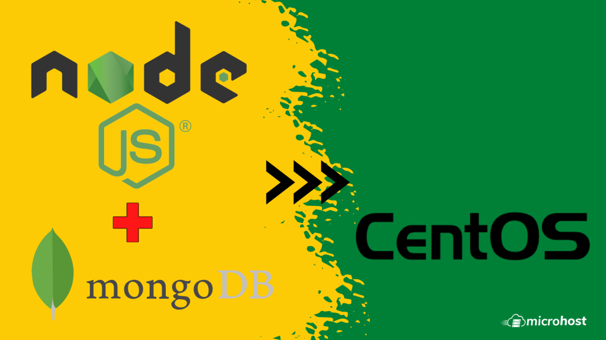

This article will help you to connect Node.js application with MongoDB. Also, configure MongoDB drive for nodejs using Mongoose node application on CentOS and Redhat systems.

## Prerequsities

We assume that Node.js and MongoDB are already installed on your server. If not installed first follow our guide below to complete the installation.

- [Install MongoDB on Centos](https://utho.com/docs/tutorial/installing-mongodb-on-centos-7/)

- [Install node.js on Centos](https://utho.com/docs/tutorial/how-to-set-up-a-node-js-application-with-apache-on-centos-7/?preview_id=1782&preview_nonce=cebe7869d0&preview=true)

## Install mongoose Module

Mongoose offers a simple schema-based approach for modeling data about the program which includes built-in typecasting, validation and much more.

```
npm install mongoose
```

## Connect Nodejs with MongoDB

Create a file test server.js, and add content to the file below. For the more details about working with Node.js and MongoDB with mongoose read [this tutorial](http://mongoosejs.com/docs/guide.html).

```
</ Sample script of Node.js with MongoDB Connection

// This code requires mongoose node module
var mongoose = require('mongoose');

// Connecting local mongodb database named test
var db = mongoose.connect('mongodb://127.0.0.1:27017/test');

// testing connectivity
mongoose.connection.once('connected', function() {
 console.log("Database connected successfully")
});
```

Now we execute the test\_server.js using node. If we get message “Database connected successfully”, It means our node.js app is successfully connecting database.

```
node test_server.js
```

**Output** - database connected successfully

We have connected Node.js Application with MongoDB successfully on CentOS.

Thankyou.
