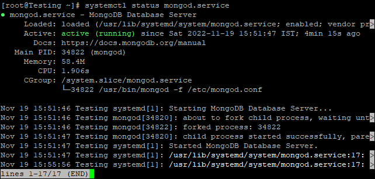

## Introduction

In this article, you will learn how to install [MongoDB](https://utho.com/docs/tutorial/how-to-install-mariadb-10-3-on-ubuntu-20-04/) on Fedora 36/35/34.

MongoDB is a non-relational document database that provides support for [JSON](https://aws.amazon.com/documentdb/what-is-json/)\-like storage. The MongoDB database has a flexible data model that enables you to store unstructured data, and it provides full indexing support, and replication with rich and intuitive APIs.

The MongoDB database was first made available to the public in February 2009 and is managed and developed by MongoDB.Inc. It is distributed under the Server Side Public License. In addition to this, it offers official driver support for all of the most common programming languages, including C, C++, C#, etc. Net, Go, Java, Node.js, Perl, PHP, Python, Motor, Ruby, Scala, Swift, and Mongoid are the programming languages that are supported. In order to enable the development of applications utilising any one of these languages. These days, there are a great number of businesses, such as Facebook, Nokia, eBay, Adobe, Google, and others, who have chosen to store their massive amounts of data using MongoDB.

## Step 1: Update System

```
# dnf -y update
```

## Step 2: Add DNF/YUM MongoDB Repositories

The addition of the repositories to the system is the initial step in installing MongoDB 4 on Fedora 36/35/34. This step may take a while.

```
# cat <<EOF | sudo tee /etc/yum.repos.d/mongodb.repo
```

```
[mongodb-org-4.4]
name=MongoDB Repository
baseurl=https://repo.mongodb.org/yum/redhat/8/mongodb-org/4.4/x86_64/
gpgcheck=1
enabled=1
gpgkey=https://www.mongodb.org/static/pgp/server-4.4.asc
EOF
```

Bringing the Yum cache index up to date:

```
# yum clean all
```

```
# yum makecache
```

Provide a list of YUM mirrors:

```
# yum repolist
```


## Step 3: Install MongoDB 4.4 on Fedora 36/35/34

The next step is to deploy the mongodb-org package on Fedora.

```
# dnf -y install mongodb-org
```

The following command will allow you to determine the version of MongoDB that is currently installed:

```
# mongo -version
```


## Step 4: Start & Enable MongoDB Service

The final step is to start the MongoDB service and enable it to start automatically on boot.

```
# systemctl start mongod.service
```

```
# systemctl enable mongod.service
```

Perform the following to check the status:

```
# systemctl status mongod.service
```



Hopefully, now you have learned how to install MongoDB on Fedora 36/35/34.

Thank You 🙂
