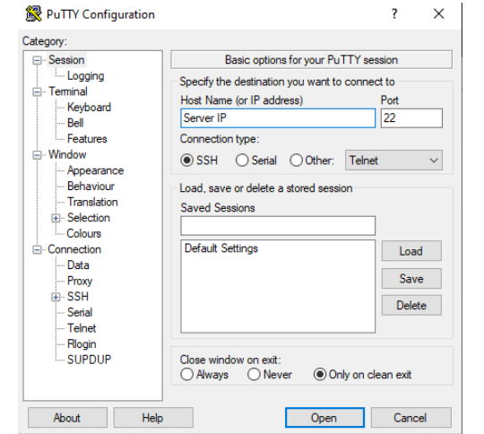
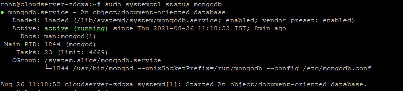
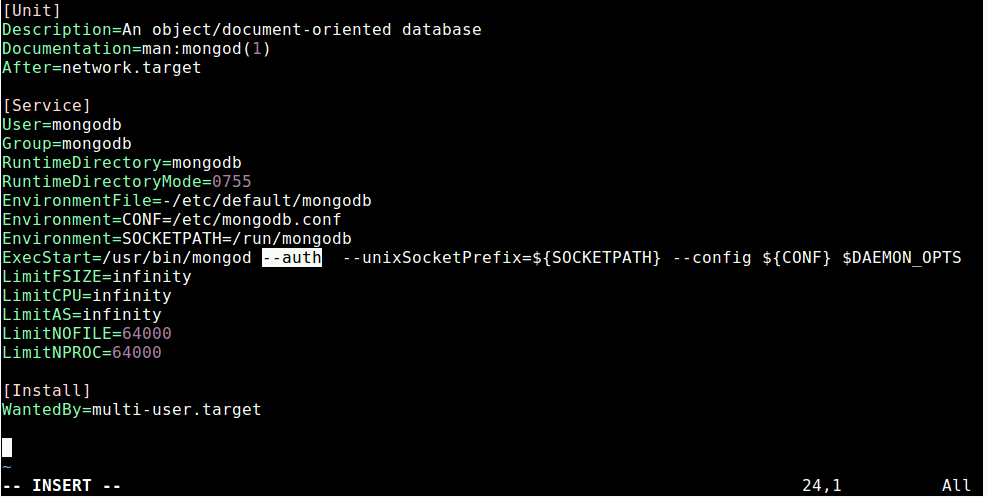

MongoDB is a document database built on a scale-out architecture that has become popular with developers of all kinds who are building scalable applications using agile methodologies. The document data model is a powerful way to store and retrieve data that allows developers to move fast.  
  it provides high performance and great scalability features, it is being used for building modern applications that require powerful, mission-critical and high-availability databases.

1\. Login the server with the root credential on the putty. 



After successfully login you will get looking like bellow mentioned screenshot.

After login first update the system software package cache to have the most latest version of the repository listings. Command given below  
```
# sudo apt update 
```

Next, install MongoDB package that includes several other packages such as mongo-tools, mongodb-clients, mongodb-server and mongodb-server-core.

```
# sudo apt install mongodb 
```

To start a MongoDB service, type the following command.

```
# sudo systemctl stop mongodb
```
To enable again MongoDB service, type the following command.

```
# sudo systemctl enable mongodb
```
Once you have successfully installed it, the MongoDB service will start automatically via systemd and the process listens on port **27017**. You can verify its status using the systemctl command as shown.

```
# sudo systemctl status mongodb
```


By default MongoDB comes with user authentication disabled, its therefore started without access control. To launch the **mongo shell**, run the following command.

```
# mongo 
```

Once you have connected to the mongo shell, you can list all available databases with the following command.

```
# show dbs 
```

switch to the admin database, then create the **root user** using following commands.

Now exit the mongo shell to enable authentication as explained next.

 The mongodb instance was started without the `--auth` command line option. You need to enable authentication of users by editing /lib/systemd/system/mongod.service file, first open the file for editing like so.  
```
sudo vim /lib/systemd/system/mongodb.service 
```

Under the `[Service]` config section, find the parameter ExecStart.

Change it to the following.



Save the file and exit it.

After making changes to configuration file, run ‘systemctl daemon-reload‘ to reload units and restart the MongoDB service and check its status as follows.

```
# systemctl daemon-reload 
```

```
# sudo systemctl restart mongodbb 
```

```
# sudo systemctl status mongodbb 
```


Now when you try to connect to mongodb, you must authenticate yourself as a MongoDB user. For example:

That’s all! MongoDB is an open-source, modern No-SQL database management system that provides high performance, high availability, and automatic scaling.

Thank you :)
