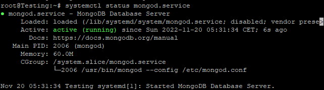
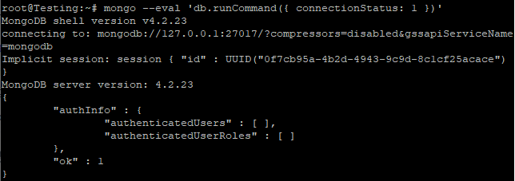
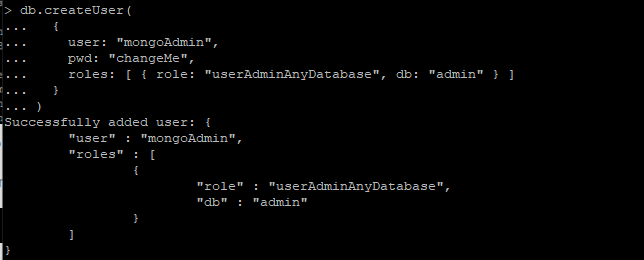

## Introduction

In this article, you will learn how to install MongoDB on Ubuntu 20.04.

MongoDB is a non-relational document database that provides support for [JSON](https://aws.amazon.com/documentdb/what-is-json/)\-like storage. The MongoDB database has a flexible data model that enables you to store unstructured data, and it provides full indexing support, and replication with rich and intuitive APIs.

The MongoDB database was first made available to the public in February 2009 and is managed and developed by MongoDB.Inc. It is distributed under the Server Side Public License. In addition to this, it offers official driver support for all of the most common programming languages, including C, C++, C#, etc. Net, Go, Java, Node.js, Perl, PHP, Python, Motor, Ruby, Scala, Swift, and Mongoid are the programming languages that are supported.

In order to enable the development of applications utilising any one of these languages. These days, there are a great number of businesses, such as Facebook, Nokia, eBay, Adobe, Google, and others, who have chosen to store their massive amounts of data using MongoDB.

## Installing MongoDB

```
# curl -fsSL https://www.mongodb.org/static/pgp/server-4.4.asc | sudo apt-key add -
```

```
# apt-key list
```


```
# echo "deb [ arch=amd64,arm64 ] https://repo.mongodb.org/apt/ubuntu focal/mongodb-org/4.4 multiverse" | tee /etc/apt/sources.list.d/mongodb-org-4.4.list
```

The package list should be brought up to date, and the mongodb-org meta-package should be installed.

```
# apt update
```

```
# apt install mongodb-org
```

## Starting the MongoDB Service

```
# systemctl start mongod.service
```

```
# systemctl status mongod
```



```
# systemctl enable mongod
```

Connecting to the MongoDB database server with the help of the mongo tool and printing the [connection](https://utho.com/docs/tutorial/how-to-test-internet-connection-speed-in-ubuntu-20-04/) status allows one to determine whether or not the installation was carried out without incident.

```
# mongo --eval 'db.runCommand({ connectionStatus: 1 })'
```



If the ok field has the value 1, then the operation was successful.

## Creating Administrative MongoDB User

If you chose to enable the MongoDB authentication, you will be required to generate an administrative user who is authorised to access and control the MongoDB instance. To accomplish this, log into the Mongo shell using:

```
# mongo
```


In order to connect to the administrative database, enter the following command while you are within the MongoDB shell:

```
# use admin
```


Execute the following command in order to create a new user with the name mongoAdmin who will have the role of userAdminAnyDatabase:

```
db.createUser(
  {
    user: "mongoAdmin", 
    pwd: "changeMe", 
    roles: [ { role: "userAdminAnyDatabase", db: "admin" } ]
  }
)
```

output:



Exit the mongo shell with the following:

```
# quit()
```

## Conclusion

Hopefully, now you have learned how to install MongoDB on Ubuntu 20.04.

Thank You 🙂
