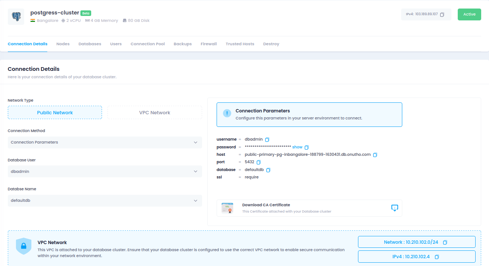
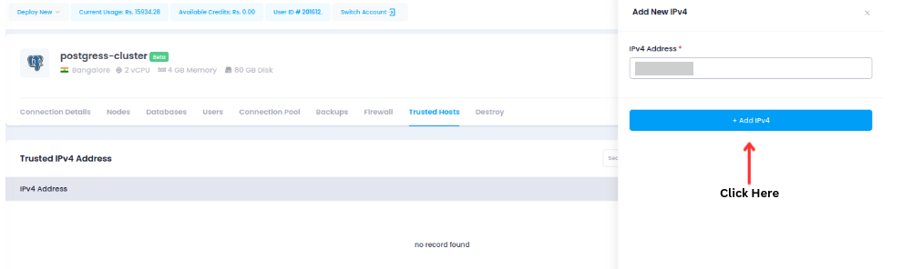
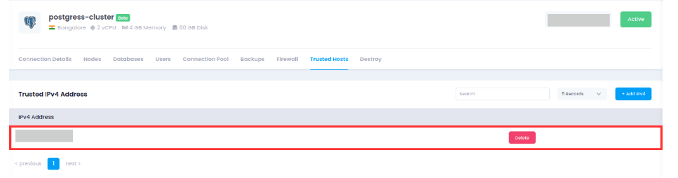
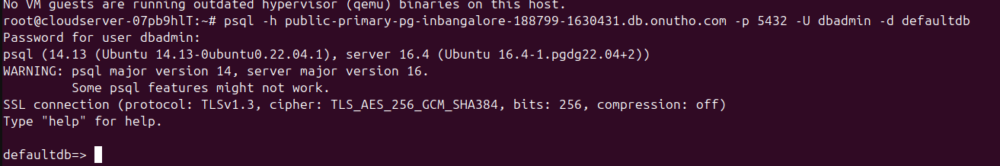

---

title: "How to  Connect using PostgreSQL Client with Utho's Managed PostgreSQL DataBase"
date: "2024-11-26"
title_meta: "How to  Connect using PostgreSQL Client with Utho's Managed PostgreSQL DataBase"
description: "Learn how to deploy, connect, and manage a PostgreSQL database using a managed interface. This guide covers trusted host setup, connecting with PostgreSQL client, user and database management, creating backups, setting up firewalls, and securely deleting databases. Perfect for simplifying database management while ensuring security and scalability."
keywords: ["Deploy MySQL Database", "Connect to PostgreSQL", "Managed MySQL", "Database Firewall", "PostgreSQL Backup", "Database User Management"]
tags: ["PostgreSQL", "Database Management", "Managed Database", "Firewall Protection", "Database Backups", "Utho Cloud","Utho Cloud Databases"]
icon: "Databases"
lastmod: "2024-11-26T10:00:00+00:00"
draft: false
weight: 1
toc: true
tab: true

---

## **How to  Connect using PostgreSQL Client with Utho's Managed PostgreSQL DataBase**

This document provides a step-by-step guide on how to configure and connect to a managed MySQL database.

---

### **Prerequisites**
- Access to the **Utho Cloud UI**.
- Need **PostgreSQL Manage DataBase**.  

---

### **Deployment Steps**

This is the Utho manage Database interface where you can view the PostgreSQL
databases.



You need to add a trusted host to your managed PostgreSQL database.

-   Click on **Add IPV4**



-   After that add your IP in I**PV4 Address.**




## **Connecting to PostgreSQL Managed Database**

### **1. Install PostgreSQL Client**

Ensure the PostgreSQL client is installed on your Ubuntu machine.
```
sudo apt update
```

```
sudo apt install postgresql-client 
```
I just bought the new domain proqx.cloud from Hostinger.

- **Host:** Database server's hostname or IP address.
- **Port:** The port (default is 5432).
- **Database Name:** The name of the database.
- **Username:** Your database user.
- **Password:** Your database password.

### **3. Connect Using PostgreSQL Client**

Use the PostgreSQL command to connect:
```
psql -h <host> -p <port> -U <username> -d <database_name>
```



-   Replace **\<username\>** with the database user.

-   Replace **\<hostname\>** with the managed database host (e.g.: > db.example.com).

-   Replace **\<database_name\>** with the managed database name.

-   Replace **\<port\>** with the port number (default is 5432).

-   You\'ll be prompted to enter your password.

----