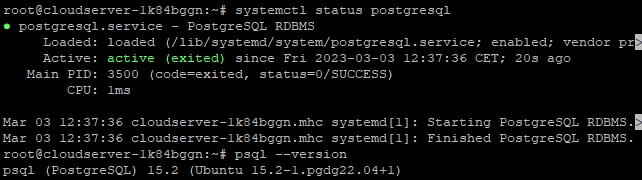

## Introduction

In this article, you will learn how to Install PostgreSQL 15 on Ubuntu 22.04.

[PostgreSQL](https://en.wikipedia.org/wiki/PostgreSQL) is a powerful object-relational database system that is available as free open source software. It makes use of and extends the SQL language, and it combines this with a number of features that allow it to safely store and grow even the most complex data demands.

PostgreSQL was initially developed in 1986 as a part of the POSTGRES project at the University of California, Berkeley. The core platform has seen continuous development for more than 35 years. PostgreSQL's origins may be traced back to 1986.

## 1\. Enable the PostgreSQL Package Repository

First, get the latest packages. Apt update can do this:

```
# apt update

```

Since the PostgreSQL 15 package is not currently accessible in the default package repository, you will need to enable PostgreSQL's official package repository using the following commands.

```
# sudo sh -c 'echo "deb http://apt.postgresql.org/pub/repos/apt $(lsb\_release -cs)-pgdg main" > /etc/apt/sources.list.d/pgdg.list'

```

```
# wget -qO- https://www.postgresql.org/media/keys/ACCC4CF8.asc | sudo tee /etc/apt/trusted.gpg.d/pgdg.asc &>/dev/null

```

## 2\. Install PostgreSQL 15 Database Server and Client

In addition, the postgresql-client package is responsible for installing the client tool, whereas the postgresql package will install the default version of the PostgreSQL database server.

Let's install the client and server for PostgreSQL using the apt command that is listed below:

```
# apt install postgresql postgresql-client -y

```

After that, let's check to see if the PostgreSQL service is online and functional:

```
# systemctl status postgresql

```


Next, using the psql command line programme, check to see what version of PostgreSQL is currently installed:

```
# psql --version

```


## 3\. Change the Password for the PostgreSQL Admin User

We don't need to enter a password in order to connect to the PostgreSQL server because that setting is default. Now, let's put this into action with the help of the psql utility:

```
# sudo -u postgres psql

```

In this example, we will be using the postgres user. During the process of installing PostgreSQL, a user with administrative privileges is automatically established.

It is not a good idea to give administrative users access to the database without requiring them to provide a password. Hence, let's go ahead and change the password for the postgres user:

```
# ALTER USER postgres PASSWORD 'demoPassword';

```

The user's password is set to demoPassword by the SQL query above. Please note that because this is a demo environment, we used a very simple password. But it's not a good idea to do the same thing in a production environment.

Let's make sure that the password was set up correctly. So, first, use the q command to end the current session with the server.

```
# \\q

```

The outcome of the commands above.


Now, let's get reconnecting with the database server:

```
# psql -h localhost -U postgres

```

Entering the demoPassword string as a password connects us to the database.


## 4\. Set up PostgreSQL for Remote Access

By default, only the localhost can connect to PostgreSQL. We can easily change the configuration, though, so that remote clients can connect.

PostgreSQL gets its settings from the file postgresql.conf, which is in the directory /etc/postgresql//main/. Here, the word "version" shows which major version of PostgreSQL is being used.

In our case, for example, the file's full path is /etc/postgresql/15/main/postgresql.conf.

```
# vi /etc/postgresql/15/main/postgresql.conf

```

Now, in a text editor, replace the word "localhost" with "\*" at the beginning of the line that begins with the listen addresses.

This option can be found under the CONNECTIONS AND AUTHORIZATION submenu. The updated file will look like this:


By using escape:wq, you can save and close the file. 

The next step is to open up IPv4 connections from all clients by editing the pg\_hba.conf file. In addition to the /etc/postgresql/15/main/ directory, this file can also be found there.

```
# vi /etc/postgresql/15/main/pg\_hba.conf

```

Here's how the updated file will look like:


The above- mentioned configurations indicate a willingness to take on connections from the 192.168.1.0/24 network.

If you're using Ubuntu as a firewall, you can open port 5432 for PostgreSQL by typing the following command.

```
# ufw allow 5432/tcp

```

## 5\. Checking Remote Connection

Once you've finished, restart the service and make sure it's running:

```
# systemctl restart postgresql

```

```
# systemctl status postgresql

```



Now that we have that settled, let's proceed to access the DB from a remote client.

```
# psql -h 192.168.1.192 -U postgres

```


From this point on, we are able to see that the remote client can access the database.

## Conclusion

Hopefully, now you have learned how to Install PostgreSQL 15 on Ubuntu 22.04.

Also Read: [How to Install MariaDB 10.3 on Ubuntu 20.04](https://utho.com/docs/tutorial/how-to-install-mariadb-10-3-on-ubuntu-20-04/)

Thank You 🙂
