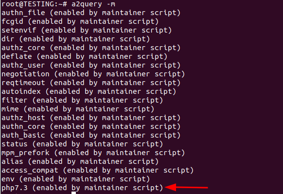
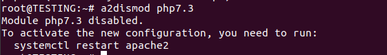
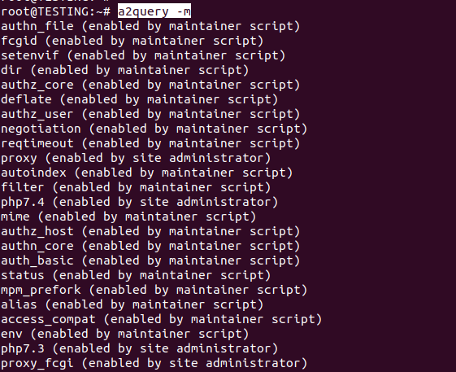

<figure>


<figcaption>

How to check, disable and enable PHP modules.

</figcaption>

</figure>

## Description:

In this tutorial, we will learn how to check, disable and enable PHP modules.If you run a system or [web server](https://utho.com/docs/tutorial/what-is-nginx/), you need to know how to install and use different versions of PHP on the same server. This is very helpful when you have more than one PHP programme on your server and each one works with a different version of PHP. Linux distribution Ubuntu supports PHP. PHP needs to be introduced, as opposed to Python, which is preinstalled in the basic system.

**a2enmod** is a script that enables the specified module within the **[apache2](https://httpd.apache.org/)** configuration. It does this by creating symlinks within /etc/apache2/mods-enabled. Likewise, **a2dismod** disables a module by removing those symlinks. It is not an error to enable a module which is already enabled, or to disable one which is already disabled.

## How to show enabled php modules

You can show every mod which is being used by php.

```
# a2query -m 
```

<figure>


<figcaption>

Every PHP mod used by php

</figcaption>

</figure>

## How to disable a php module

Step 1. First we should check, which modules are enabled.

```
# a2query -m 
```

<figure>



<figcaption>

All enabled mod

</figcaption>

</figure>

Step 2. Now if you want to disable any module, just remember the first word of the above output. For example, if you want to disable php7.3 module

```
# a2dismod php7.3 
```

<figure>



<figcaption>

All disabled mod

</figcaption>

</figure>

## How to enable any module

Now to add any module, you just need to know the name of the mod

```
# a2enmod php7.4 
```

<figure>


<figcaption>

Add the php7.4 mod

</figcaption>

</figure>

Now after enabling any php mod, you need to reload the daemon service and restart the apache.

Now finally check whether the desired module is enable or not

```
# a2query -m 
```

<figure>



<figcaption>

Check the enabled mod

</figcaption>

</figure>

In this article you have learnt how to check, disable and enable PHP modules.
