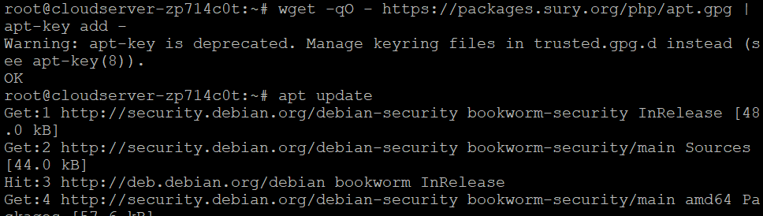
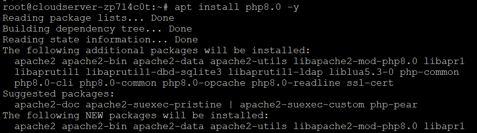
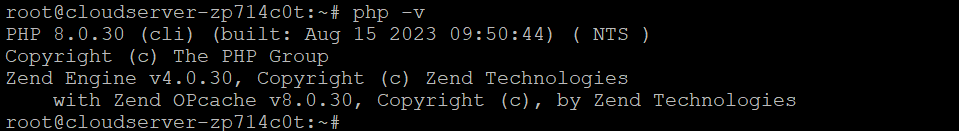
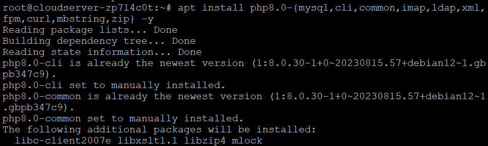

## Introduction

In this article you will learn how to install PHP 8 on Debian 12.

[PHP](https://en.wikipedia.org/wiki/PHP) is the most widely used server-side scripting language in creation of dynamic web pages. PHP applications usually work well with HTML and interact with relation database management systems, here are the steps to Install PHP 8 on Debian 12.

PHP is an open-source server-side programming language that may be used to construct a wide range of various things, such as websites, applications, and customer relationship management systems. PHP is a server-side programming language. It is a programming language that may be used for a variety of purposes and is rather popular. Additionally, it can be included into HTML. Because PHP can work with HTML, it has remained one of the most widely used programming languages in the development community. This is due to the fact that PHP contributes to the simplification of the HTML code.

The phrase "PHP: Hypertext Preprocessor" is what the acronym PHP refers to, with the "PHP" in PHP initially standing for "Personal Home Page" inside this abbreviation. Since its creation in 1994, the phrase has gone through a number of modifications in order to provide a more accurate description of the nature of the entity to which it refers.

For nearly three decades, PHP has been a go-to language for web development thanks to its many features and flexibility.

#### Step 1: Update System

```
# apt update

```

```
# apt -y upgrade

```

#### Step 2: Add Surý APT repository

```
# apt update

```

```
# apt install -y lsb-release ca-certificates apt-transport-https software-properties-common gnupg2

```

**Your Debian server should have the PHP packages APT repository added to it.**

```
# echo "deb https://packages.sury.org/php/ $(lsb\_release -sc) main" | tee /etc/apt/sources.list.d/sury-php.list

```

**Import repository key:**

```
# wget -qO - https://packages.sury.org/php/apt.gpg | apt-key add -

```



**Ensure that the package index has been updated before verifying that the repository has been added:**

```
# apt update

```

#### Step 3: Install PHP 8 on Debian 12

```
# apt install php8.0 -y

```



```
# php -v

```



#### Step 4: Install PHP 8 Extensions on Debian 12

```
# apt install php8.0-<extension>

```

**The term "extension" will be changed to the actual name of the extension.**

**The following is a list of some of the possible extensions:**

```
# apt install php8.0-{mysql,cli,common,imap,ldap,xml,fpm,curl,mbstring,zip} -y

```



**Make sure that all of the other PHP extensions in the repository follow the same installation structure. Use the following command to check the loaded PHP modules:**

```
# php -m

```


## Conclusion

I hope you have learned how to install PHP 8 on Debian 12.

**Also Read:** [How to Use Iperf to Test Network Performance](https://utho.com/docs/tutorial/how-to-use-iperf-to-test-network-performance/)

Thank You 🙂
