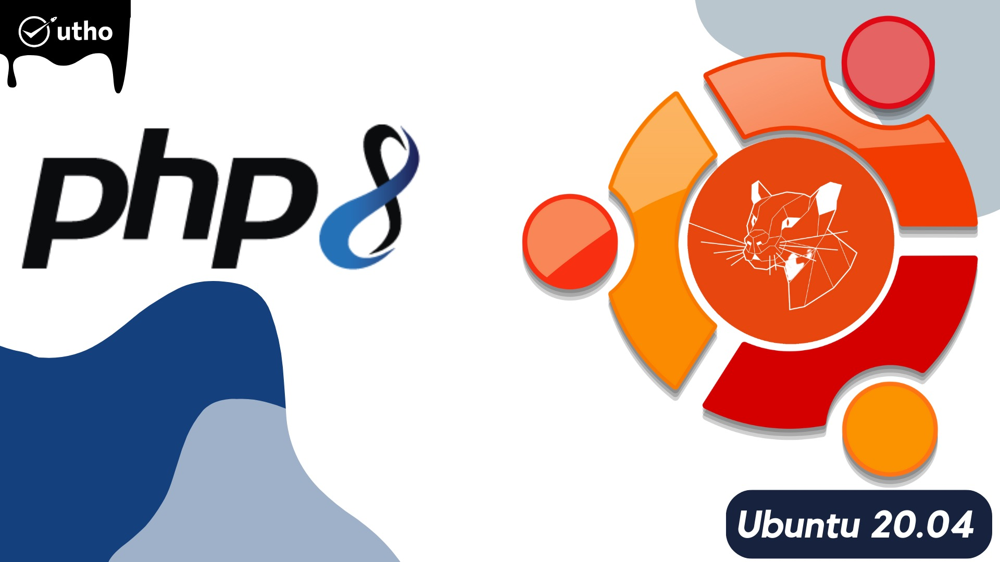

## Introduction

In this article you will learn how to install PHP 8 on Ubuntu 20.04.

[PHP](https://en.wikipedia.org/wiki/PHP) is the most widely used server-side scripting language in creation of dynamic web pages. PHP applications usually [work](https://utho.com/docs/tutorial/how-to-test-internet-connection-speed-in-ubuntu-20-04/) well with HTML and interact with relation database management systems, here are the steps to Install.

PHP is an open-source server-side programming language that may be used to construct a wide range of various things, such as websites, applications, and customer relationship management systems. PHP is a [server](https://utho.com/docs/tutorial/category/webserver-tutorial/)\-side programming language. It is a programming language that may be used for a variety of purposes and is rather popular. Additionally, it can be included into HTML. Because PHP can work with HTML, it has remained one of the most widely used programming languages in the development community. This is due to the fact that PHP contributes to the simplification of the HTML code.

The phrase "PHP: Hypertext Preprocessor" is what the acronym PHP refers to, with the "PHP" in PHP initially standing for "Personal Home Page" inside this abbreviation. Since its creation in 1994, the phrase has gone through a number of modifications in order to provide a more accurate description of the nature of the entity to which it refers.

For nearly three decades, PHP has been a go-to language for web development thanks to its many features and flexibility.

##### **Step 1: Update system repositories**

```
# apt update
```

##### **Step 2: Install required dependencies**

```
# apt install lsb-release ca-certificates apt-transport-https software-properties-common -y
```

##### **Step 3: Set up PHP repository**

```
#  add-apt-repository ppa:ondrej/php
```

To continue reading the prompt, please hit the "Enter" button:

##### **Step 4: Install PHP 8 on Ubuntu 20.04**

```
# apt install php8.0 -y
```

##### **Step 5: Verify PHP version**

```
# php -v
```


##### **Step 6: Install PHP 8 Extensions**

```
# apt install php8.0-cli php8.0-common php8.0-imap php8.0-redis php8.0-xml php8.0-zip php8.0-mbstring
```

##### **Step 7: Check PHP 8 loaded modules**

```
# php -m
```


## Conclusion

I hope you have learned how to install PHP 8 on Ubuntu 20.04.

Thank You 🙂
