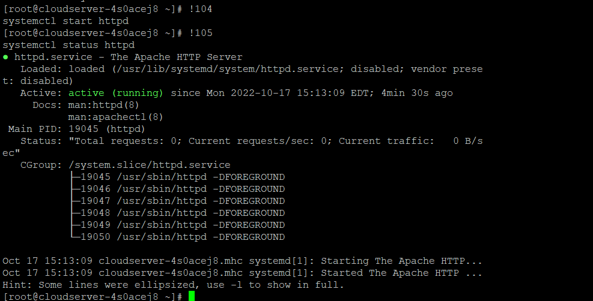

**Description**

The command history is one of the most useful aspects of the Bash shell. This feature logs all of the commands that a user executes and keeps them in a file located in the user's home directory (usually /home/$USER/.bash history). This makes it simple for the user to recall, amend, and perform previously executed instructions again.

In this piece, we will illustrate how to re-execute a particular command by retrieving it from the history of commands that have been input into a shell. This allows you to avoid repeatedly inputting the same commands, which is a helpful feature.

In a normal situation, you can utilise the Up arrow keys to recover a previous command in order to acquire a command that you just ran lately. Maintaining consistent pressure on it will cycle through many commands in the history, allowing you to locate the one you want more quickly. To move in the other direction, use the Down arrow on your keyboard.

You can use the history command if you want to re-execute a certain command from the history of commands. However, the history file may contain a lot of entries.

```
# history 
```


The next step is to obtain the number(s) of the command(s) you wish to re-execute. For instance, if you want to start httpd and inspect its status, you will need to re-execute the instructions 104 and 105, as shown.

```
# !104 
```

```
# 105 
```



You can also re-execute a command that you have already used (for example, sudo yum update) by using the '!' character followed by a few of the first characters (for example, sud or sudo) of that particular command, as demonstrated here.

```
# !sud 
```

or

```
# !sudo 
```


The command history, stored in /home/$USER/.bash history, is one of Bash's best features. The user may simply recall, amend, and rerun past commands.

We'll show you how to rerun a shell command in this article. To prevent inputting the same commands, this is beneficial.

Use the Up arrow keys to retrieve a recent command. To find the command you want, press it again. Reverse with the Down arrow.

To re-execute a specific command from the history file, run the history command.

**Thank You**
