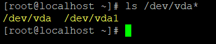
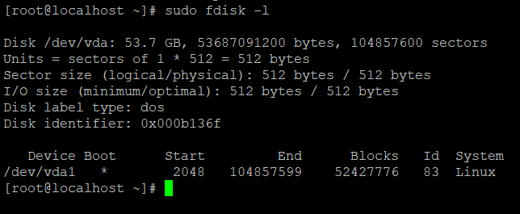

**Description**

In this article we will learn 4 Effective Ways to Determine the Name of a Plugged USB Device in [Linux](https://utho.com/docs/tutorial/how-to-create-encrypt-and-decrypt-random-passwords-in-linux/).

One of the many aspects of Linux that you should become proficient in as a beginner is the identification of devices that are connected to your computer. It could be the hard disc in your computer, an external hard drive, or another type of portable media like a USB drive or an SD Memory card.

The use of USB drives for the transfer of files is extremely common in today's world. For those (new Linux users) who prefer to work from the command line, becoming familiar with the various methods by which a USB device name can be identified is very important when it comes time to format the device.

After you have connected a device to your computer, such as a USB drive, particularly on a desktop computer, the device is automatically mounted to a specific directory, which is typically located under /media/username/device-label. You are then able to access the files contained within the device by navigating to the directory in which it is mounted. On the other hand, this is not the case while working with a server, since you will need to manually mount a device and then designate where it should be mounted.

The /dev directory houses specialised device files that are used by Linux to determine the identity of hardware. This directory contains a number of files, one of which is /dev/sda or /dev/hda, which represents your first master drive. Each partition will be represented by a number, such as /dev/sda1 or /dev/hda1 for the first partition, and so on for subsequent partitions.

Follow the below steps to learn 4 Effective Ways to Determine the Name of a Plugged USB Device in [Linux](https://en.wikipedia.org/wiki/Linux)..

## Find Disk

```
# ls /dev/vda*
```

or

```
# ls /dev* 
```




Now, let's find out the names of the devices by utilising a variety of command-line tools, as indicated below:

## Using the df command, get the name of the connected USB device

The df programme, which analyses the consumption of disc space in Linux systems, can be used, as demonstrated in the following image, to view each device that is connected to your computer as well as its mount point:

```
# df -h 
```


## Find the Name of a USB Device with the lsblk Command

You can also use the lsblk command, which stands for "list block devices." This command will list all block devices that are currently connected to your system in the following format:

```
# lsblk 
```


## Determine the Name of the USB Device Using the fdisk Utility

It is possible to execute fdisk with root privileges in the following manner: fdisk is a powerful application that prints out the partition table on all of your block devices, including USB drives.

```
# sudo fdisk -l 
```



## Using the dmesg Command, Determine the Name of the USB Device

A crucial command, dmesg, prints or controls the kernel ring buffer, a data structure that holds information about the activities of the kernel.

To read kernel operation messages, run the command that is listed below. This command will also output information about your USB device:

```
# dmesg 
```


In this post, we have discussed various strategies for determining the name of a USB device using the command line, and that will be all we cover for the time being.

I really expect that you have a complete understanding of all of the steps. 4 Effective Ways to Determine the Name of a Plugged USB Device in Linux

Must read :- [https://utho.com/docs/tutorial/how-to-create-encrypt-and-decrypt-random-passwords-in-linux/](https://utho.com/docs/tutorial/how-to-create-encrypt-and-decrypt-random-passwords-in-linux/)

**Thank You**
