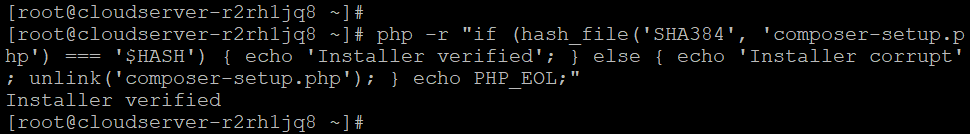
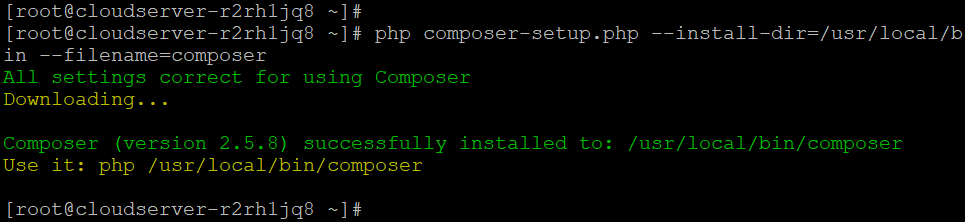

## Introduction

In this article, you will learn how to install Composer on Almalinux 8.

[Composer](https://en.wikipedia.org/wiki/Composer) is an open source tool for managing PHP dependencies. It was made to make it easier to distribute and maintain PHP files as separate application components. It has changed the PHP ecosystem in a big way by laying the groundwork for current PHP development with applications and frameworks that are built from elements.

#### Step 1: Install Dependencies

**Install the PHP CLI (command-line interface) package along with everything else that needs to be done by:**

```
# dnf install php-cli php-json php-zip wget unzip -y

```


#### Step 2: Download and Install Composer

**Once PHP CLI has been successfully set up, download the Composer installation script:**

```
# php -r "copy('https://getcomposer.org/installer', 'composer-setup.php');"

```

**With the above command, a file called "composer-setup.php" is downloaded into the working directory, which is the directory that is currently being used.**

**The file's SHA-384 hash should be checked against the hash on the Composer Public Keys / Signatures page. This will make sure the information is correct.**

**The following wget command will get the latest Composer installation's signature from the Composer Github website and save it in a variable called HASH:**

```
# HASH="$(wget -q -O - https://composer.github.io/installer.sig)"

```

**Run the following command to make sure that the installation script hasn't been messed up:**

```
# php -r "if (hash\_file('SHA384', 'composer-setup.php') === '$HASH') { echo 'Installer verified'; } else { echo 'Installer corrupt'; unlink('composer-setup.php'); } echo PHP\_EOL;"

```

**If the hashes are the same, this output will appear:**



**If the hashes don't match, on the other hand, you'll find that the Installer file is broken. After the authenticity has been proven, move on to the next step.**

**For Composer to be installed in the /usr/local/bin directory, the following command must be run:**

```
# php composer-setup.php --install-dir=/usr/local/bin --filename=composer

```



**When the previous command instals it, all users on the system can use the composer command. This is what the final product will look like.**

**When the previous command installs it, all users on the system can use the composer command.**

**To test your installation, run:**

```
# composer

```


## Conclusion

Hopefully, now you have learned how to install Composer on Almalinux 8.

**Also Read:** [How to Use Iperf to Test Network Performance](https://utho.com/docs/tutorial/how-to-use-iperf-to-test-network-performance/)

Thank You 🙂
