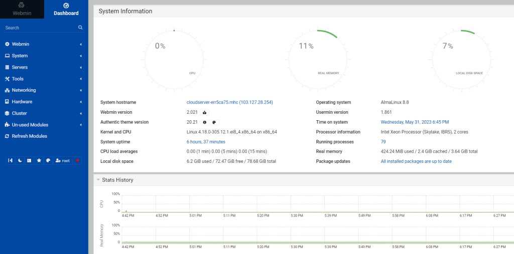

## Introduction

In this article, you will learn how to install Webmin on AlmaLinux 8.

[Webmin](https://en.wikipedia.org/wiki/Webmin) is a tool that we may use to control our command line AlmaLinux 8 server that is running without any kind of graphical interface. It is an open-source utility that only requires a few instructions in order to be quickly installed. It provides remote management of the server network as well as the hardware and backup, among other features.

Users have the ability to install a variety of modules to extend the functionality of the system. These modules include the ability to add support for LAMP, a Heartbeat Monitor, a Squid Proxy Server, a DHCP server, and many more.

In this tutorial, we will go over the steps required to install Webmin on AlmaLinux 8 by making use of the command line and the official repository.

#### Step 1: Add Webmin Repository

**Let's go ahead and add the Webmin yum repository to Almalinux 8 so that we can access the Webmin packages and install them with only one command.**

```
# vi /etc/yum.repos.d/webmin.repo

```

**Copy and paste the following content in your file and save it by pressing escape: wq**

```
[Webmin]
name=Webmin Distribution Neutral
### not using ### baseurl=https://download.webmin.com/download/yum
mirrorlist=https://download.webmin.com/download/yum/mirrorlist
enabled=1
gpgkey=https://download.webmin.com/jcameron-key.asc
gpgcheck=1

```

#### Step 2: Update the system

**Execute the system update command, which makes the repository cache to be refreshed and will help the system to recognise the most recent Webmin repository addition along with all of the packages that are available under it.**

```
# dnf update -y

```

#### Step 3: Install Webmin

**At long last, everything we require is in its proper location. On our Almalinux Linux operating system that is based on RPM, let's now execute a single command in order to download and install Webmin.**

```
# dnf install webmin

```


#### Step 4: Allow Port in Firewall

**To access the web interface of this web-based system configuration tool from any system browser that can reach the Server's IP address or domain where we put it, we have to open a Webmin port number of 10000 in the Firewall.**

```
# firewall-cmd --add-port=10000/tcp --permanent

```


```
# firewall-cmd --reload

```


#### Step 5: Access Webmin

**If you use Webmin on a machine with a graphical user interface, you can use the local address in the URL, like http://localhost:10000.**

```
# https://server-ip-address:10000

```


**After logging into the webmin, you can manage your server through GUI mode.**



## Conclusion

Hopefully, now you have learned how to install Webmin on AlmaLinux 8.

**Also Read:** [How to Use Iperf to Test Network Performance](https://utho.com/docs/tutorial/how-to-use-iperf-to-test-network-performance/)

Thank You 🙂
