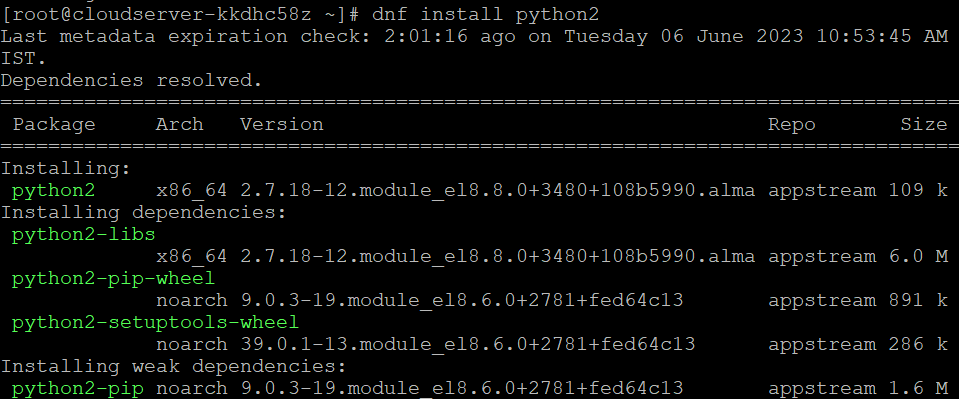

## Introduction

In this article you will learn how to test internet speed on Almalinux 8.

When you notice that the speed at which you can access the internet on your server is slow, the first thing you need to do in order to remedy the problems caused by the slow connectivity is to check the [connection speed](https://en.wikipedia.org/wiki/Speedtest.net).

The SpeedTest CLI makes it possible to monitor the current internet speed of your AlmaLinux server from the command line. Additionally, it delivers dependable technology and a worldwide service network to the command line, which is the driving force behind SpeedTest.

**Step 1: Python can be installed on your machine by executing the command that is provided in the following section.**

```
# dnf install python2 -y

```



**Step 2: Using the command that is given below, download the file called speedtest\_cli.py.**

```
# wget -O speedtest-cli https://raw.githubusercontent.com/sivel/speedtest-cli/master/speedtest.py

```


**Step 3: To make the script file executable, use the command that is listed below.**

```
# chmod +x speedtest-cli

```

**Step 4: You are now able to test the speed of your system's internet connection by using the speedtest-cli command.**

```
# python2 speedtest-cli

```


**Step 5: Execute the following command to determine how fast your internet connection is in bytes.**

```
# python2 speedtest-cli --bytes

```


## Conclusion

Hopefully, Now you have learned how to test internet speed on Almalinux 8.

**Also Read:** [How to Use Iperf to Test Network Performance](https://utho.com/docs/tutorial/how-to-use-iperf-to-test-network-performance/)

Thank You 🙂
